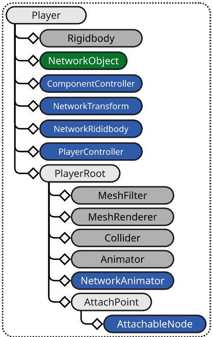
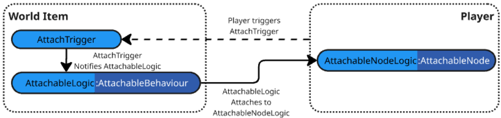

# Physics

There are many different ways to manage physics simulation in multiplayer games. Netcode for GameObjects has a built in approach that allows for server-authoritative physics where the physics simulation only runs on the server. To enable network physics, add a [NetworkRigidBody component](../components/helper/networkrigidbody.md) to your object.

## Physics and latency

A common issue with physics in multiplayer games is lag and how objects update on different timelines. For example, players are often on a timeline that's offset by the network latency relative to your server's objects. You can compensate for this by testing your game with artificial lag to catch any unexpected behavior.

The best way to address the issue of physics latency is to create a custom [NetworkTransform](../components/helper/networktransform.md) with a custom physics-based interpolator. You can also use the [Network Simulator tool](https://docs.unity3d.com/Packages/com.unity.multiplayer.tools@latest?subfolder=/manual/network-simulator) to spot issues with latency.

## Message processing vs. applying changes to state (timing considerations)

When handling the synchronization of changes to certain physics properties, it's important to understand the order of operations involved in message processing relative to the update stages that occur within a single frame. The stages occur in this order:

- Initialization _(Awake and Start are invoked here)_
- EarlyUpdate _(Inbound messages are processed here)_
- FixedUpdate _(Physics simulation is run and results)_
- PreUpdate _(NetworkTime and Tick is updated)_
- Update _(NetworkBehaviours/Components are updated)_
- PreLateUpdate: _(Useful for handling post-update tasks prior to processing and sending pending outbound messages)_
- LateUpdate: _(Useful for changes to camera, detecting input, and handling other post-update tasks)_
- PostLateUpdate: _(Dirty NetworkVariables processed and pending outbound messages are sent)_

From this list of update stages, the `EarlyUpdate` and `FixedUpdate` stages have the most impact on NetworkVariableDeltaMessage and RpcMessages processing. Inbound messages are processed during the `EarlyUpdate` stage, which means that Rpc methods and NetworkVariable.OnValueChanged callbacks are invoked at that point in time during any given frame. Taking this into consideration, there are certain scenarios where making changes to a Rigidbody could yield undesirable results.

## Parenting and Rigidbody components

Since PhysX has no concept of local space, it can be difficult to synchronize two Rigidbodies. Netcode for GameObjects provides two methods for handling this:

- Use a [Joint](https://docs.unity3d.com/Documentation/ScriptReference/Joint.html), although this is the more complicated option.
  - The [Social Hub demo](https://github.com/Unity-Technologies/com.unity.multiplayer.samples.bitesize/tree/main/Basic/DistributedAuthoritySocialHub) project provides an example of using a `FixedJoint`.
- Use an [AttachableBehaviour component](../components/helper/attachablebehaviour.md) to handle this for you.
  - Using an AttachableBehaviour component requires some initial prefab hierarchy organization, but generally produces faster and more consistent results. However, it doesn't cover all physics-based parenting scenarios (but does cover most of them).

## Using AttachableBehaviour or Joint

The implementation of physics in a networked project differs from a single player project. This is especially true when you're using NetworkTransform and NetworkRigidbody components with [`NetworkRigidbody.UseRigidBodyForMotion`](https://docs.unity3d.com/Packages/com.unity.netcode.gameobjects@latest?subfolder=/api/Unity.Netcode.Components.NetworkRigidbodyBase.html#Unity_Netcode_Components_NetworkRigidbodyBase_UseRigidBodyForMotion) enabled. Deciding whether to use a Joint or an AttachableBehaviour component depends on your project's requirements.

For example, if you want to create world items that players can pick up, you may have the following requirements:

- Each world item should be impacted by physics whether picked up or not.
- When not picked up, the world item acts like a normal physics object.
- When picked up, it should:
   - Add to the player's overall mass.
   - Extend the collision boundary of the player.
     - This requires the picked up item to ignore the item's colliders but cause the player's Rigidbody to react (collide) based on any interactions the item might have with other physics world objects.
- The implementation should be modular and easy to customize by both level designers and scripting programmers.

In most cases, it's recommended to [use an AttachableBehaviour component](#using-attachablebehaviour-for-parenting-physics-objects), unless you have specific requirements for your child physics object that necessitate the use of a Joint, such as:

- Does your child physics object need to interact with other child physics objects?
  - Do the interactions involve collisions between the children under the parent?
  - Does each child, under the same parent, require having physics-driven velocities independent of, but relative to, the parent?
  - Were you planning on using a physics joint (like a [SpringJoint](https://docs.unity3d.com/Documentation/Manual/class-SpringJoint.html)) anyway?

> [!NOTE]
> Netcode for GameObjects uses the kinematic feature of Unity's Rigidbody and Rigidbody2d to dictate who has physics authority. The authority is non-kinematic which allows physics to impact the object's velocities, collide with other bodies, and have various forces applied (frictional or otherwise). Non-authority instances are kinematic and synchronize the motion of the authority's non-kinematic body via [NetworkTransform](../components/helper/networktransform.md) or writing your own custom transform synchronizing NetworkBehaviour based script.

### Using AttachableBehaviour for parenting physics objects

> [!NOTE]
> If you haven't already done so, it's recommended that you refer to the [AttachableBehaviour](../components/helper/attachablebehaviour.md) documentation to better understand the attaching process before proceeding.

You should use an AttachableBehaviour component if your physics object doesn't require any child object interactions or independent physics-driven velocities relative to the player's motion. This will provide you with the functionality required to handle parenting only a portion of an object underneath another physics object, including:

- Allowing the world item to have physics applied when picked up or placed in the world somewhere.
- Extending the player's collision boundary and, if the collider has a physics material applied, it will be used when it collides with other non-kinematic bodies.
    - A Rigidbody updates its known colliders when an object is parented underneath it.

Starting with the [AttachableBehaviour](../components/helper/attachablebehaviour.md) world item diagram:


Making some finalizations on the components you would use might initially look something like this:


The world item has been further defined by including the following components:

- On the root prefab GameObject:
  - Added a Rigidbody
  - Added a NetworkTransform
  - Added a NetworkRigidbody
- On the AttachedView GameObject:
  - Added a Collider

The logical flow is:

- When the world item is not picked up, the MeshRenderer and Collider are disabled on the AttachedView.
- When the world item is picked up (attached), the previously mentioned AttachedView's disabled components are enabled while the MeshRenderer and Collider are disabled on the WorldView.

The next step is to determine what kind of adjustments you might want to make on your player prefab. Relative to the [AttachableBehaviour player prefab diagram](../components/helper/attachablebehaviour.md#player), your end result might look something close to this:



Where your project doesn't require a left or right hand position but just a single location to attach your items (AttachPoint) which has an [AttachableNode](../components/helper/attachablenode.md) component. In cases where there's no requirement to independently move the item, it makes more sense to let the animation and player's motion drive the position of the item at any given moment since both are already synchronized between instances.

> [!NOTE]
> By adding a NetworkTransform that synchronizes in local space to the attach point you can introduce a smooth transition to picking something up by teleporting the AttachPoint, in local space, to the location of the item being picked up. You can get the local space player-relative position by performing an inverse transform point by using the player's transform to transform the world space position of the item being picked up. A script would be required to handle the motion of the item to the player.

### Rigidbody and nested child colliders

Below is a screenshot of a prototype world item that, when the player (capsule) runs over the item a collider trigger invokes the `OnTriggerEnter` callback that attaches the AttachedView to an AttachableNode. Prior to triggering the attach event, they are viewed as two unique non-kinematic physics objects:


However, once the item is picked up and the AttachedView is parented under the AttachPoint, the player's Rigidbody starts including the AttachedView's collider and (if set) the physics material assigned to the collider in its physics updates:


When moving the player around, if there is another physics object or static collider (world geometry) that impacts the collider on the now parented AttachedView, if using the physics debugger you can see that the player's Rigidbody is detecting the collision:


It's this core mechanic that's leveraged when using the AttachableBehaviour approach to parenting physics objects under physics objects and removes the more complex (to synchronize) physics Joint approach.

### Combining mass

The final step to complete the world item feature is to address the last three requirements:

- Write a script to make sure the parent WorldItem stays in place when AttachView is attached to a player.
  - This requires knowing when the item is being attached and detached.
- Write a script to combine the world item's mass with the player's mass.
  - This too requires knowing when the item is being attached and detached.
- Write a script that handles detecting player entering the trigger collider to parent the object.

The high level logical flow would look something like this:



Where:

- AttachTrigger: Derives from NetworkBehaviour, this class handles detecting a player within a pre-defined pick up collider configured as a trigger.
- AttachableLogic: Derives from AttachableBehaviour to leverage from the virtual method `AttachableBehaviour.OnAttachStateChanged` that's invoked when the attachable is attaching, attached, detaching, and detached.
- AttachableNodeLogic: Derives from AttachableNode to leverage from the virtual method `AttachableNode.OnOnDetached` that's invoked when the attachable is detached from the player.

From the above diagram, you can see that as the player's collider moves into the WorldItem's collider configured as a trigger it notifies the AttachableLogic which, in turn, attaches the AttachedView to the AttachableNodeLogic.

With the above additional modifications, the WorldItem looks like this:


- The AttachTrigger is added to handle the trigger event.
  - This requires another collider placed on the WorldView so while the item is not picked up it will trigger when the player's collider enters the Collider - Trigger. When attached, the MeshRenderer, Collider, and Collider - Trigger are all disabled.
- The AttachableLogic takes the place of the first pass AttachableBehaviour.

The Player requires a minor adjustment:


- The AttachableNode is updated to the new derived class AttachableLogic.

### Scripts

For the functionality described above, you would need to implement something like the following scripts:

#### AttachTrigger

A relatively simple script that includes a trigger delay to ensure if the object is dropped it doesn't immediately re-attach itself to the player.

```c#
using Unity.Netcode;
using UnityEngine;

/// <summary>
/// Placed on the world item, this will attempt to attach the AttachedView to the
/// player's AttachableNode.
/// </summary>
public class AttachTrigger : NetworkBehaviour
{
    [Tooltip("The amount of time to wait before allowing the same owner to re-trigger this instance")]
    public float SameOwnerDelay = 0.5f;
    private float m_LastTriggerTime = 0.0f;
    private AttachableLogic m_AttachableLogic;
    private GameObject m_LastPlayerToAttach;

    private void Awake()
    {
        // Find the AttachableBehaviour
        m_AttachableLogic = transform.parent.GetComponentInChildren<AttachableLogic>();
    }

    /// <summary>
    /// Used to help prevent from an item re-attaching when dropped by the player
    /// </summary>
    public void SetLastUpdateTime()
    {
        var previousLast = m_LastTriggerTime;
        m_LastTriggerTime = Time.realtimeSinceStartup + SameOwnerDelay;
    }


    private void OnTriggerEnter(Collider other)
    {
        if(!enabled || !m_AttachableLogic)
        {
            return;
        }

        // Don't retrigger immediately to avoid picking up the object as we drop it.
        if (other.gameObject == m_LastPlayerToAttach && m_LastTriggerTime > Time.realtimeSinceStartup)
        {
            return;
        }

        // Attach the item to the player
        if (m_AttachableLogic.Triggered(other))
        {
            m_LastPlayerToAttach = other.gameObject;
            SetLastUpdateTime();
        }
    }
}
```

#### AttachableLogic

This script handles making adjustments to the WorldItem's Rigidbody. When it's attaching, the WorldItem's gravity is disabled and when detaching gravity is enabled (to keep the item from endlessly falling). Also note that it zeros out the velocities of the WorldItem to ensure in place while AttachedView is attached and that it does not have any additional velocity when detached (the `Throw` method handles applying a specific force to the object when it is dropped).

```c#
using Unity.Netcode;
using Unity.Netcode.Components;
using UnityEngine;

public class AttachableLogic : AttachableBehaviour
{
    public Rigidbody Rigidbody => m_InternalRigidbody;
    private Rigidbody m_InternalRigidbody;
    private NetworkTransform m_InternalNetworkTransform;

    private TagHandle m_PlayerTag;

    protected override void Awake()
    {
        base.Awake();
        // Get the world item's Rigidbody
        m_InternalRigidbody = transform.root.GetComponent<Rigidbody>();
        // Get the world item's NetworkTransform
        m_InternalNetworkTransform = transform.root.GetComponent<NetworkTransform>();
        // Use tags to filter what triggers the parenting
        m_PlayerTag = TagHandle.GetExistingTag("PlayerTag");
    }

    /// <summary>
    /// Invoked by <see cref="AttachTrigger"/>
    /// </summary>
    /// <param name="other">the collider that caused the trigger event.</param>
    /// <returns></returns>
    public bool Triggered(Collider other)
    {
        // Don't trigger if the world item is not spawned, is attached or is being attached,
        // or something other than the player caused the trigger event.
        if (!IsSpawned || m_AttachState != AttachState.Detached || !other.CompareTag(m_PlayerTag))
        {
            return false;
        }

        // We can only attach to an AttachableNode. Make sure we can find at least one AttachableNode.
        var attachableNode = other.gameObject.GetComponentInChildren<AttachableNodeLogic>();

        // Do not attempt to attach if there is no available AttachableNode, this is not the local player,
        // or the player is already carrying something (this could be configured for a specific world item type).
        if (!attachableNode || !attachableNode.IsLocalPlayer || attachableNode.HasAttachments)
        {
            return false;
        }

        // If using a distributed authority topology, go ahead and make the local player's client the authority
        // (owner) of the world item/
        if (NetworkManager.DistributedAuthorityMode && OwnerClientId != attachableNode.OwnerClientId)
        {
            NetworkObject.ChangeOwnership(attachableNode.OwnerClientId);
        }

        // Attach the object
        Attach(attachableNode);
        return true;
    }

    /// <summary>
    /// Invoked when the attachable is attaching, attached, detatching, and detatched.
    /// </summary>
    protected override void OnAttachStateChanged(AttachState attachState, AttachableNode attachableNode)
    {
        if (!HasAuthority || !attachableNode)
        {
            return;
        }
        switch (attachState)
        {
            case AttachState.Detached:
                {
                    // Always get the NetworkObject's transform as it could be parented under another NetworkObject
                    // Position the item slightly forward, to the right, and up of the player
                    var newPosition = attachableNode.NetworkObject.transform.position + attachableNode.NetworkObject.transform.forward * 2.0f + attachableNode.NetworkObject.transform.right * 2.0f + attachableNode.transform.root.up * 2.0f;

                    // Rotate relative to the player
                    var newRotation = attachableNode.NetworkObject.transform.rotation;

                    if (m_InternalRigidbody)
                    {
                        // Assure there is no existing velocities
                        m_InternalRigidbody.linearVelocity = Vector3.zero;
                        m_InternalRigidbody.angularVelocity = Vector3.zero;
                        // Prepare Rigidbody for being in "world view mode".
                        if (m_InternalRigidbody.IsSleeping())
                        {
                            m_InternalRigidbody.WakeUp();
                        }
                        // Re-enabled gravity
                        m_InternalRigidbody.useGravity = true;
                    }

                    // Re-position the world item to the current location of the AttachedView
                    m_InternalNetworkTransform.SetState(newPosition, newRotation, teleportDisabled: false);
                    break;
                }
            case AttachState.Attaching:
                {
                    if (m_InternalRigidbody)
                    {
                        // Disabled gravity (i.e. don't fall through the world)
                        m_InternalRigidbody.useGravity = false;
                        // Assure all velocities are zeroed out
                        m_InternalRigidbody.linearVelocity = Vector3.zero;
                        m_InternalRigidbody.angularVelocity = Vector3.zero;
                        // Sleep the rigid body.
                        m_InternalRigidbody.Sleep();
                    }
                    break;
                }
        }
        base.OnAttachStateChanged(attachState, attachableNode);
    }

    /// <summary>
    /// Invoked when the item is detatched to provide some motion to the item.
    /// </summary>
    /// <param name="throwForce">amount of impulse force to apply</param>
    public void Throw(Vector3 throwForce)
    {
        m_InternalRigidbody.AddForce(throwForce, ForceMode.Impulse);
    }
}
```

#### AttachableNodeLogic

This script adds the WorldItem's mass to the initial (default) player's mass when picked up and removes it when dropped. It also handles throwing the object (you might be able to throw an object with more or less force depending upon how long you hold the throw key/button down) and handles detaching any attachable for example/testing purposes. It also implements the `INetworkUpdateSystem` interface and registers with the `NetworkUpdateLoop` when `EnableTestMode` is enabled.

```c#

using Unity.Netcode;
using Unity.Netcode.Components;
using UnityEngine;

public class AttachableNodeLogic : AttachableNode, INetworkUpdateSystem
{
    [Tooltip("Relative to the player's forward vector.")]
    public Vector3 ThrowForce = new Vector3(0, 15.0f, 20.0f);
    public bool EnableTestMode;

    private Rigidbody m_PlayerRigidbody;
    private float m_DefaultMass;

    private void Awake()
    {
        m_PlayerRigidbody = transform.root.GetComponent<Rigidbody>();
        m_DefaultMass = m_PlayerRigidbody.mass;
    }

    /// <summary>
    /// Detatches anything that is attached
    /// </summary>
    public void DetachAll()
    {
        if (!HasAttachments)
        {
            return;
        }

        for (int i = m_AttachedBehaviours.Count - 1; i >= 0; i--)
        {
            var attachableNetworkObject = m_AttachedBehaviours[i].NetworkObject;
            var attachTrigger = attachableNetworkObject.transform.GetComponentInChildren<AttachTrigger>();
            if (attachTrigger)
            {
                attachTrigger.SetLastUpdateTime();
            }
            m_AttachedBehaviours[i].Detach();
        }
    }

    public override void OnNetworkSpawn()
    {
        if (IsOwner && EnableTestMode)
        {
            NetworkUpdateLoop.RegisterNetworkUpdate(this, NetworkUpdateStage.Update);
        }
        base.OnNetworkSpawn();
    }

    /// <summary>
    /// Used to register with <see cref="NetworkUpdateLoop"/> when <see cref="EnableTestMode"/> is enabled.
    /// </summary>
    public override void OnNetworkDespawn()
    {
        if (EnableTestMode)
        {
            NetworkUpdateLoop.UnregisterNetworkUpdate(this, NetworkUpdateStage.Update);
        }
        base.OnNetworkDespawn();
    }

    public void NetworkUpdate(NetworkUpdateStage updateStage)
    {
        if (!IsSpawned)
        {
            return;
        }

        // Drop anything picked up
        if (Input.GetKeyDown(KeyCode.T) && HasAttachments)
        {
            DetachAll();
        }
    }

    protected override void OnDetached(AttachableBehaviour attachableBehaviour)
    {
        if (!HasAuthority)
        {
            return;
        }

        // Set the mass back to the default
        m_PlayerRigidbody.mass = m_DefaultMass;
        var attachableLogic = attachableBehaviour as AttachableLogic;
        // Throw the object in a specific direction
        attachableLogic.Throw(NetworkObject.transform.right * ThrowForce.x + Vector3.up * ThrowForce.y + NetworkObject.transform.forward * ThrowForce.z);
        base.OnDetached(attachableBehaviour);
    }

    protected override void OnAttached(AttachableBehaviour attachableBehaviour)
    {
        var attachableLogic = attachableBehaviour as AttachableLogic;

        // Set the mass based off of the default mass plus the attachable's mass
        m_PlayerRigidbody.mass = m_DefaultMass + attachableLogic.Rigidbody.mass;

        base.OnAttached(attachableBehaviour);
    }
}
```