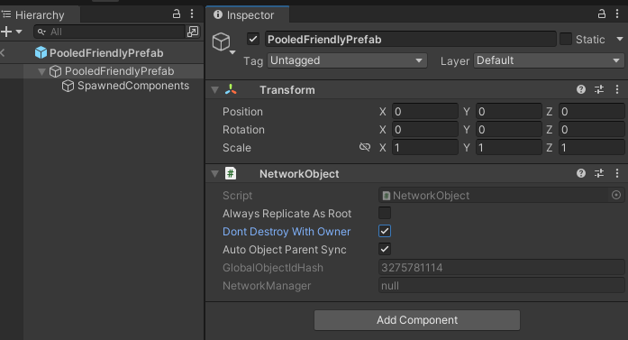
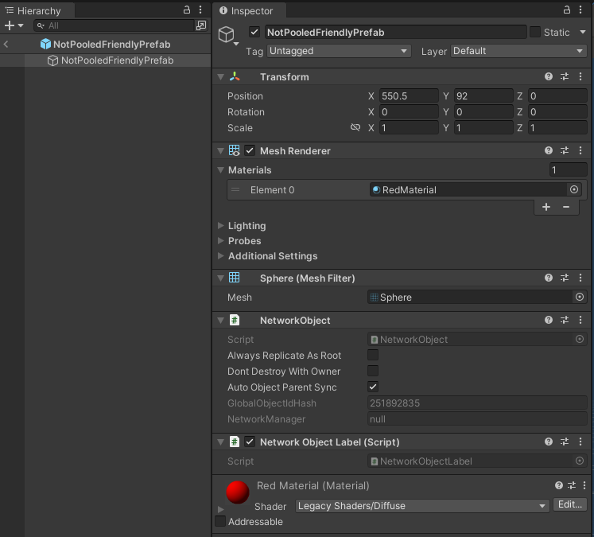
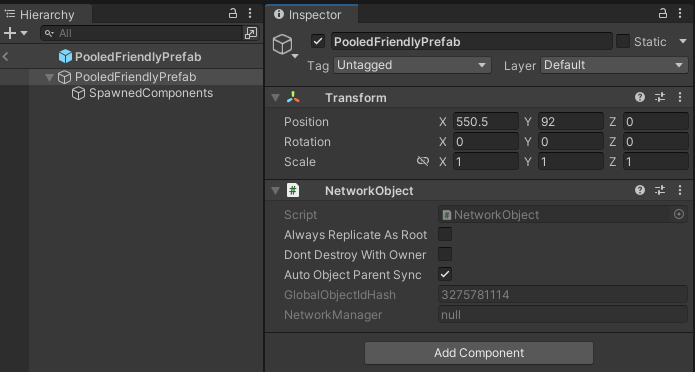
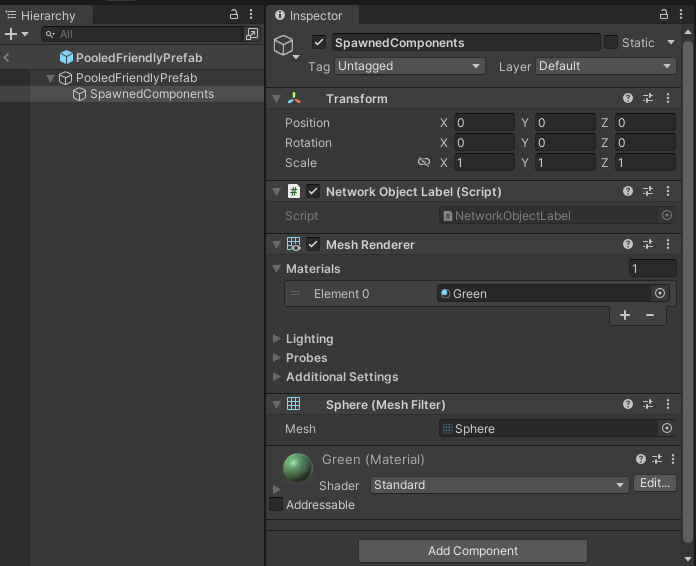

# Object spawning

In Unity, you typically create a new game object using the `Instantiate` function. Creating a game object with `Instantiate` will only create that object on the local machine. `Spawning` in Netcode for GameObjects (Netcode) means to instantiate and/or spawn the object that is synchronized between all game clients.

## Network prefabs

A network prefab is any unity prefab asset that has one `NetworkObject` component attached to a `GameObject` within the prefab. More commonly, the `NetworkObject` component is attached to the root `GameObject` of the prefab asset because this allows any child `GameObject` to have `NetworkBehaviour` components automatically assigned to the `NetworkObject`. The reason for this is that a `NetworkObject` component attached to a `GameObject` will be assigned (associated with) any `NetworkBehaviour` components on:

- the same `GameObject` that the `NetworkObject` component is attached to
- any child or children of the `GameObject` that the `NetworkObject` is attached to.

> [!NOTE]
> A caveat of the above two rules is when one of the children `GameObject`s also has a `NetworkObject` component assigned to it (a.k.a. "Nested NetworkObjects"). Because nested `NetworkObject` components aren't permited in network prefabs, Netcode for GameObjects will notify you in the editor if you are trying to add more than one `NetworkObject` to a prefab and won't allow you to do this.

When a `NetworkBehaviour` is assigned to a `NetworkObject`, the `NetworkObject.NetworkObjectId` is used to help determine which `NetworkBehaviour` component instance will receive an update to a `NetworkVariable` or where to invoke an RPC. A `NetworkObject` component can have one or more `NetworkBehaviour` components assigned to it.

### Registering a network prefab

You must register a Network prefab instance with a `NetworkManager` using a `NetworkedprefabsList` scriptable object.
There are four steps to registering a network prefab with a `NetworkManager`:

1. Create a Network prefab by creating a prefab with a `NetworkObject` component attached to the root `GameObject`.
2. Create a scriptable object called `NetworkedprefabsList` by right-clicking the project window, then: `Create/Netcode/NetworkedprefabsList`.
3. Add your Network prefab to the `NetworkprefabsList`.
4. Add the `NetworkprefabsList` to the Network prefabs Lists that's associated with a `NetworkManager`.

### Spawning a network prefab (overview)

When using a [server authoritative networking model](../terms-concepts/authority.md#server-authority) only the server or host can spawn netcode objects. Under a [distributed authority networking model](../terms-concepts/authority.md#distributed-authority), any game client can spawn netcode objects. The game client that spawned the network object then becomes the [authority](../terms-concepts/authority.md) of that object.

To spawn a network prefab, you must first create an instance of the network prefab and then invoke the spawn method on the NetworkObject component of the instance you created. In most cases, you will want to keep the NetworkObject component attached to the root GameObject of the network prefab.

By default, a newly spawned network prefab instance is owned by the authority unless otherwise specified.

See [Ownership](networkobject.md#ownership) for more information.

The following is a basic example of how to spawn a network prefab instance:

```csharp
var instance = Instantiate(myprefab);
var instanceNetworkObject = instance.GetComponent<NetworkObject>();
instanceNetworkObject.Spawn();
```

The `NetworkObject.Spawn` method takes 1 optional parameter that defaults to `true`:

```csharp
public void Spawn(bool destroyWithScene = true);
```

When you set the destroyWithScene property to `false` it will be treated the same as when you set [Object.DontDestroyOnLoad](https://docs.unity3d.com/ScriptReference/Object.DontDestroyOnLoad.html). Typically, you use this if you are loading a scene using [LoadSceneMode.Single](https://docs.unity3d.com/ScriptReference/SceneManagement.LoadSceneMode.html) parameter.

[Learn more about Netcode Scene Management here](scenemanagement/scene-management-overview.md)

> [!NOTE]
> You might find it useful to add a `GameObject` property in a `NetworkBehaviour`-derived component to use when assigning a network prefab instance for dynamically spawning. You need to make sure to instantiate a new instance **prior** to spawning. If you attempt to just spawn the actual network prefab instance it can result in unexpected results.

### Taking prefab overrides into consideration

Sometimes, you might want to use a different prefab instance on the authority compared to other clients. You should take this into consideration when dynamically spawning a network prefab. If you're running as a host, you want the override to spawn since a host is both a server and a client. However, if you also want to have the ability to run as a dedicated server, you might want to spawn the source network prefab.

There are two ways you can accomplish this, as explained below.

#### Get the network prefab override first

This option provides you with the overall view of getting the network prefab override, instantiating it, and then spawning it.

```csharp
var instance = Instantiate(NetworkManager.GetNetworkprefabOverride(myprefab));
var instanceNetworkObject = instance.GetComponent<NetworkObject>();
instanceNetworkObject.Spawn();
```

In the above script, we get the prefab override using the `NetworkManager.GetNetworkprefabOverride` method. Then we create an instance of the network prefab override, and finally we spawn the network prefab override instance's `NetworkObject`.

#### Using InstantiateAndSpawn

The second option is to leverage the `NetworkSpawnManager.InstantiateAndSpawn` method that handles whether or not to spawn an override for you. The below script is written as if it's being invoked within a `NetworkBehaviour`.

```csharp
var networkObject = NetworkManager.SpawnManager.InstantiateAndSpawn(myprefab, ownerId);
```

We pass in the overridden source network prefab we want to have instantiated and spawned, and then it returns the instantiated and spawned `NetworkObject` of the spawned object. The default behavior of `InstantiateAndSpawn` is to spawn the original source prefab if running as a server and the override otherwise.

`InstantiateAndSpawn` has several parameters to provide more control over this process:

```csharp
InstantiateAndSpawn(NetworkObject networkprefab, ulong ownerClientId = NetworkManager.ServerClientId, bool destroyWithScene = false, bool isPlayerObject = false, bool forceOverride = false, Vector3 position = default, Quaternion rotation = default)
```

Looking at the parameters, we can see it defaults to the server as the owner, ensures that the instantiated `NetworkObject` won't be destroyed if the scene is unloaded, is not spawned as a player, has a `forceOverride` parameter, and provides a way to set the position and rotation of the newly instantiated `NetworkObject`.

The `forceOverride` parameter, when set to true, will always use the override.

To override prefabs on non-authority game clients, refer to the [network prefab handler page](../advanced-topics/network-prefab-handler.md).

## Destroying and despawning

By default, a spawned network prefab instance that is destroyed on the authority will be automatically destroyed on all clients.

When a client disconnects, all network prefab instances dynamically created during the network session will be destroyed on the client-side by default. If you don't want that to happen, set the `DontDestroyWithOwner` field on `NetworkObject` to true before despawning.

To do this at runtime:

```csharp
m_SpawnedNetworkObject.DontDestroyWithOwner = true;
m_SpawnedNetworkObject.Despawn();
```

To make this the default from the editor Inspector view:



As an alternative, you can make the `NetworkObject.DontDestroyWithOwner` property default to `true` by setting it on the `NetworkObject` itself like in the above screenshot.

### Despawning

Only the authority can despawn a NetworkObject, and the default despawn behavior is to destroy the associated GameObject. To despawn but not destroy a NetworkObject, call `NetworkObject.Despawn` and pass false as the parameter. Non-authority clients will always be notified and will mirror the despawn behavior. If you despawn and destroy on the authority then all other connected clients will despawn and then destroy the GameObject that the NetworkObject component is attached to.

On the non-authority side, you should never call `Object.Destroy` on any GameObject with a NetworkObject component attached to it (this isn't supported and will cause an exception to be thrown). To allow non-authority clients to destroy objects they do not own, have the relevant client invoke an RPC to defer the despawning on the authority side.

The only way to despawn a NetworkObject for a specific client is to use `NetworkObject.NetworkHide`. Refer to the [object visibility page](object-visibility.md) for more information.

> [!NOTE]
> If you have `GameObject` children, with `NetworkBehaviour` components attached, of a parent `GameObject`, with a `NetworkObject` component attached, you can't disable the `GameObject` children before spawning or despawning. Doing so, in v1.0.0, can cause unexpected results and it's recommended to make sure all children are enabled in the hierarchy before spawning or despawning.

## Dynamically spawned network prefabs

Netcode for GameObjects uses the term "dynamically spawned" to convey that the `NetworkObject` is being spawned via user specific code. Whereas a player or in-scene placed `NetworkObject` (with scene management enabled) is typically spawned by Netcode for GameObjects. There are several ways to spawn a network prefab via code:

### Dynamic spawning (non-pooled):

This type of dynamically spawned `NetworkObject` typically is a simple wrapper class that holds a reference to the prefab asset. In the example below, the `NonPooledDynamicSpawner.prefabToSpawn` property holds a reference to the network prefab:

```csharp
    public class NonPooledDynamicSpawner : NetworkBehaviour
    {
        public GameObject prefabToSpawn;
        public bool DestroyWithSpawner;
        private GameObject m_prefabInstance;
        private NetworkObject m_SpawnedNetworkObject;

        public override void OnNetworkSpawn()
        {
            // Only the authority spawns, other clients will disable this component on their side
            enabled = HasAuthority;
            if (!enabled || prefabToSpawn == null)
            {
                return;
            }
            // Instantiate the GameObject Instance
            m_prefabInstance = Instantiate(prefabToSpawn);

            // Optional, this example applies the spawner's position and rotation to the new instance
            m_prefabInstance.transform.position = transform.position;
            m_prefabInstance.transform.rotation = transform.rotation;

            // Get the instance's NetworkObject and Spawn
            m_SpawnedNetworkObject = m_prefabInstance.GetComponent<NetworkObject>();
            m_SpawnedNetworkObject.Spawn();
        }

        public override void OnNetworkDespawn()
        {
            if (HasAuthority && DestroyWithSpawner && m_SpawnedNetworkObject != null && m_SpawnedNetworkObject.IsSpawned)
            {
                m_SpawnedNetworkObject.Despawn();
            }
            base.OnNetworkDespawn();
        }
    }
```

Consumable and/or items that can be picked up by a player or NPC(that is, a weapon, health, potion, etc.) would be some examples of when you might want to use non-pooled dynamically spawned `NetworkObjects`.

> [!NOTE]
> While the NonPooledDynamicSpawner example is one of the simplest ways to spawn a NetworkObject, there is a memory allocation cost associated with instantiating and destroying the GameObject and all attached components. This design pattern can sometimes be all you need for the netcode game asset you are working with, and other times you might want to respawn/re-use the object instance. When performance is a concern and you want to spawn more than just one `NetworkObject` during the lifetime of the spawner or want to repeatedly respawn a single `NetworkObject`, the less proccessor and memory allocation intensive technique is to use [pooled dynamic spawning](#pooled-dynamic-spawning).

> [!NOTE]
> Generally, the term "non-pooled" refers to the concept that a GameObject will be instantiated on all game clients each time an instance is spawned.

### Pooled dynamic spawning

Pooled dynamic spawning is when netcode objects (`GameObject` with one `NetworkObject` component) aren't destroyed on game clients when despawned. Instead, specific components are just disabled (or the `GameObject` itself) when a netcode object is despawned. A pooled dynamically spawned netcode object is typically instantiated during an already memory allocation heavy period of time (like when a scene is loaded or even at the start of your application before even establishing a network connection). Pooled dynamically spawned netcode objects are more commonly thought of as more than one netcode object that can be re-used without incurring the memory allocation and initialization costs. However, you might also run into scenarios where you need just one dynamically spawned netcode object to be treated like a pooled dynmically spawned netcode object.

Fortunately, Netcode for GameObjects provides you with a way to be in control over the instatiation and destruction process for one or many netcode objects by via the `INetworkprefabInstanceHandler` interface. Any `INetworkprefabInstanceHandler`implementation should be registered with the `NetworkprefabHandler`(for multiple netcode objects see [Object Pooling](../advanced-topics/object-pooling.md)) to accomplish this.

The easiest way to not destroy a network prefab instance is to have something, other than the instance itself, keeping a reference to the instance. This way you can simply set the root `GameObject` to be inactive when it's despawned while still being able to set it active when the same network prefab type needs to be respawned. Below is one example of how you can accomplish this for a single netcode object instance:

```csharp
public class SinglePooledDynamicSpawner : NetworkBehaviour, INetworkprefabInstanceHandler
{
    public GameObject prefabToSpawn;
    public bool SpawnprefabAutomatically;

    private GameObject m_prefabInstance;
    private NetworkObject m_SpawnedNetworkObject;


    private void Start()
    {
        // Instantiate our instance when we start (for all connected game clients)
        m_prefabInstance = Instantiate(prefabToSpawn);

        // Get the NetworkObject component assigned to the prefab instance
        m_SpawnedNetworkObject = m_prefabInstance.GetComponent<NetworkObject>();

        // Set it to be inactive
        m_prefabInstance.SetActive(false);
    }

    private IEnumerator DespawnTimer()
    {
        yield return new WaitForSeconds(2);
        m_SpawnedNetworkObject.Despawn();
        StartCoroutine(SpawnTimer());
        yield break;
    }

    private IEnumerator SpawnTimer()
    {
        yield return new WaitForSeconds(2);
        SpawnInstance();
        yield break;
    }

    /// <summary>
    /// Invoked only on non-authority clients
    /// INetworkprefabInstanceHandler.Instantiate implementation
    /// Called when Netcode for GameObjects need an instance to be spawned
    /// </summary>
    public NetworkObject Instantiate(ulong ownerClientId, Vector3 position, Quaternion rotation)
    {
        m_prefabInstance.SetActive(true);
        m_prefabInstance.transform.position = transform.position;
        m_prefabInstance.transform.rotation = transform.rotation;
        return m_SpawnedNetworkObject;
    }

    /// <summary>
    /// Called on all game clients
    /// INetworkprefabInstanceHandler.Destroy implementation
    /// </summary>
    public void Destroy(NetworkObject networkObject)
    {
        m_prefabInstance.SetActive(false);
    }

    public void SpawnInstance()
    {
        if (!HasAuthority)
        {
            return;
        }

        if (m_prefabInstance != null && m_SpawnedNetworkObject != null && !m_SpawnedNetworkObject.IsSpawned)
        {
            m_prefabInstance.SetActive(true);
            m_SpawnedNetworkObject.Spawn();
            StartCoroutine(DespawnTimer());
        }
    }

    public override void OnNetworkSpawn()
    {
        // We register our network prefab and this NetworkBehaviour that implements the
        // INetworkprefabInstanceHandler interface with the prefab handler
        NetworkManager.prefabHandler.AddHandler(prefabToSpawn, this);

        if (!HasAuthority || !SpawnprefabAutomatically)
        {
            return;
        }

        if (SpawnprefabAutomatically)
        {
            SpawnInstance();
        }
    }

    public override void OnNetworkDespawn()
    {
        if (m_SpawnedNetworkObject != null && m_SpawnedNetworkObject.IsSpawned)
        {
            m_SpawnedNetworkObject.Despawn();
        }
        base.OnNetworkDespawn();
    }

    public override void OnDestroy()
    {
        // This example destroys the
        if (m_prefabInstance != null)
        {
            // Always deregister the prefab
            NetworkManager.Singleton.prefabHandler.RemoveHandler(prefabToSpawn);
            Destroy(m_prefabInstance);
        }
        base.OnDestroy();
    }
}
```

You might run across a situation where you still want other components on the root `GameObject` of your network prefab instance to remain active. Primarily, you want to be able to easily disable the components that would normally be active when the netcode object is considered spawned.

Below is an example of what a non-pooled friendly prefab might look like:



The issues you might run into with the above prefab hierarchy is that everything is on a single `GameObject`, and as such if you wanted to disable the `MeshRenderer` and the `NetworkObjectLabel`, [one of our classes in the Netcode for GameObjects test project](https://github.com/Unity-Technologies/com.unity.netcode.gameobjects/blob/f0631414e5a5358a5ac7811d43273b1a82a60ca9/testproject/Assets/Scripts/NetworkObjectLabel.cs#L4), you would need to get those component types before disabling them (that is, during `Start` or `OnNetworkSpawn` or get them when `OnNetworkDespawn` is invoked).

To reduce this level of complexity, a more "pooled dynamic spawning" friendly prefab heirarchy might look like this:



The `NetworkObject` sits at the root `GameObject` of the network prefab. The child `GameObject`, SpawnedComponents, then has everything that you might want to have disabled when the network prefab instance isn't spawned:



This reduces the complexity down to setting the SpawnedComponents `GameObject` to inactive, which will also disable all of the components attached to it.

> [!NOTE]
> Using this type of a hierarchical separation is useful in many ways (especially when you have a much more complex prefab). For more complex prefabs, you can further expand this pattern into specific categories (that is, visuals, physics, sound, etc) which will provide you with a more macrocosmic way to control enabling or disabling many different components without having to have references to all of them.

## In-scene placed `NetworkObject`

Any objects in the scene with active and spawned `NetworkObject` components will get automatically replicated by Netcode. There is no need to manually spawn them when scene management is enabled in the `NetworkManager`. In-scene placed `NetworkObjects` should typically be used like a "static" netcode object, where the netcode object is typically spawned upon the scene being loaded on the authority-side and synchronized with other clients once they finish loading the same scene.

[Learn more about In-Scene Placed `NetworkObjects`](scenemanagement/inscene-placed-networkobjects.md)

Generally, there are **two** modes that define how an in-scene placed `NetworkObject` is synchronized.

- Soft Synchronization (Scene Management enabled)
- prefab Synchronization (Scene Management disabled)

### Soft synchronization

`SoftSync` or "Soft Synchronization" is a term you might run across if you run into any issue with in-scene placed `NetworkObjects`. Soft synchronization only occurs if scene management is enabled in the `NetworkManager` properties. If you receive a "soft synchronization error", then this typically means that a client can't locate the same in-scene placed `NetworkObject` after loading a scene.

### Prefab synchronization

`prefabSync` or "prefab Synchronization" is used if scene management is disabled in the `NetworkManager`. With prefab synchronization, every in-scene placed `NetworkObject` has to be a network prefab and must be registered with `Networkprefabs` list. When a client starts, Netcode will destroy all existing in-scene placed `NetworkObject`s and spawn its corresponding prefab from the `Networkprefabs` list instead. This also means that you will have to implement your own scene manager and handle how you synchronize clients when they join a network session.

**prefabSync is ONLY recommended for advanced development and/or multi project setups**.
