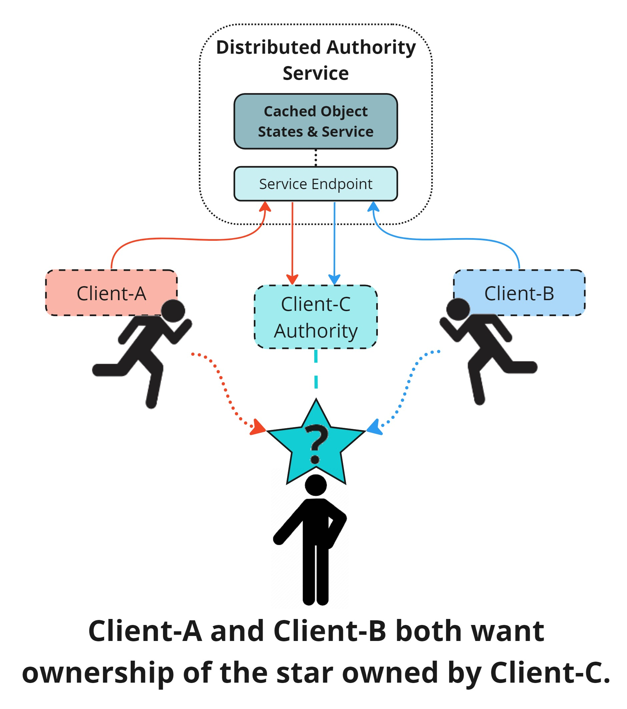
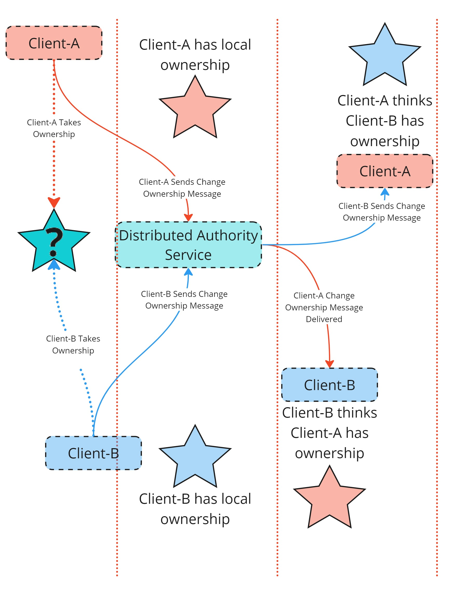

# Ownership race conditions

> [!NOTE]
> The race conditions described on this page only affect games using a [distributed authority topology](../terms-concepts/distributed-authority.md).

Ownership race conditions can occur when two players (clients) want to take ownership of the same NetworkObject at the same time. The following diagram illustrates a typical race condition where two clients (A and B) want to take ownership of an object (the star owned by Client-C) simultaneously.

## Potential race conditions

When two clients attempt to take ownership of the same NetworkObject at the same time, the outcome can vary depending on the `OwnershipStatus` of the NetworkObject.

* `OwnershipStatus.None`: If ownership status isn't transferable, but Client-A and Client-B attempt to request ownership anyway, they’ll both receive a local ownership notification, via `NetworkObject.OnOwnershipPermissionsFailure`, with a status of `OwnershipPermissionsFailureStatus.NotTransferable`. This only occurs if the user script of both clients don't check the NetworkObject ownership permissions first.
* `OwnershipStatus.Distributable`: If this is the only ownership flag on the NetworkObject, then the end result for both clients is the same as `OwnershipStatus.None` above.
* `OwnershipStatus.RequestRequired`: If ownership transfer requires a request, then there are a few potential outcomes:
    * If both clients attempt to locally change the ownership of the NetworkObject without first making a request, they'll both receive a local ownership notification, via `NetworkObject.OnOwnershipPermissionsFailure`, that they must request ownership (`OwnershipPermissionsFailureStatus.RequestRequired`).
    * If both clients send a request for ownership to the authoritative client, then it can be treated as a 'first come first serve' request (this is the default response of an authoritative client) or, if the user script assigns a callback handler to the `NetworkObject.OnOwnershipRequested`, it will be up to the user script as to whether Client-A or Client-B is granted ownership. This is still handled in a 'first come first serve' fashion, but does provide an additional level of control over granting ownership upon request.
* `OwnershipStatus.Transferable`: If ownership is transferable and requests are not required, then ownership can be acquired by both clients simultaneously if the action or user script performed happens at the same time and occurs within a period of time less than the average RTT of both clients. This is where a true race condition can occur, and the end result can be ownership getting out of sync across clients. See the diagram below.

## Preventing race conditions

There are broadly three ways to help prevent these types of race conditions.

* **Require ownership requests**: You can use the `RequestRequired` permission flag to ensure that any changes in ownership require a request first. This prevents race conditions, but requires two RTTs to complete the transfer of ownership, and can be too slow in situations where acquisition of ownership is time sensitive.
* **Use the distributed authority service**: The distributed authority service provides a certain level of governance over ownership transfer during a change in ownership of a NetworkObject with just the `Transferable` flag set.
* **Lock ownership**: When changing ownership, the user script can lock ownership for any period of time using `NetworkObject.SetOwnershipLock`. If this operation is performed immediately after changing ownership, then both the change in ownership and the updated ownership permissions are sent in the same message batch at the end of the frame. This helps the distributed authority service to govern and prevent race conditions more effectively, while also preventing immediate turnover of ownership to another client shortly after (within a few network ticks period of time) changing ownership locally.

How you choose to prevent race conditions depends on how quickly you need to transfer ownership from one client to another, and how much contingency you intend to implement.

* `OwnershipStatus.RequestRequired`: Is not prone to race conditions, but can take two RTTs (one RTT for the requestor and one RTT for the grantor/authority). If immediate ownership transfer is not required (that is, acquiring ownership in the same frame), then this is the recommended permissions setting to use.
* `OwnershipStatus.Transferable`: If not used in conjunction with ownership locking, can be prone to potential race-like conditions. Moreover, ownership could be transferred, locally, to a client for a full RTT period before receiving a change in ownership message that gives ownership to a client that had changed ownership slightly earlier. While this type of scenario can be managed, it’s worth noting that while immediate (i.e. `Transferable`) ownership transfer permissions provide a much faster transfer in ownership, it should be used with caution and a denial of ownership contingency script could be needed to handle such scenarios.
