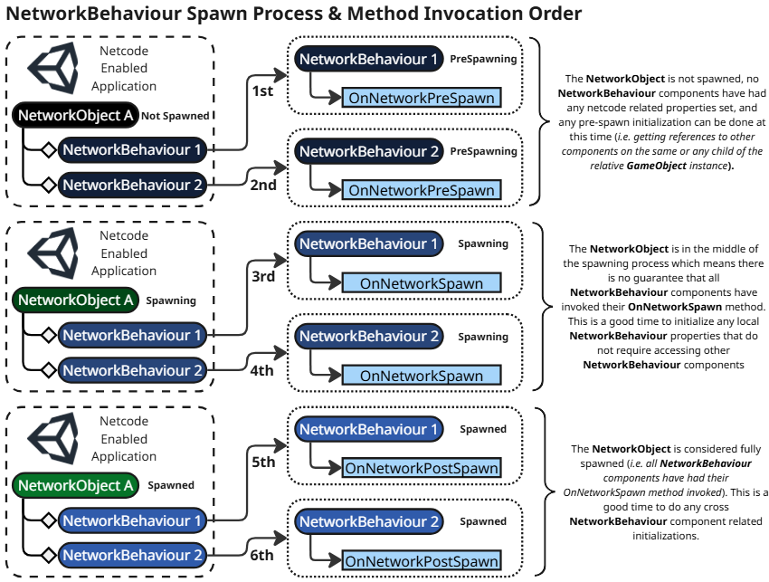
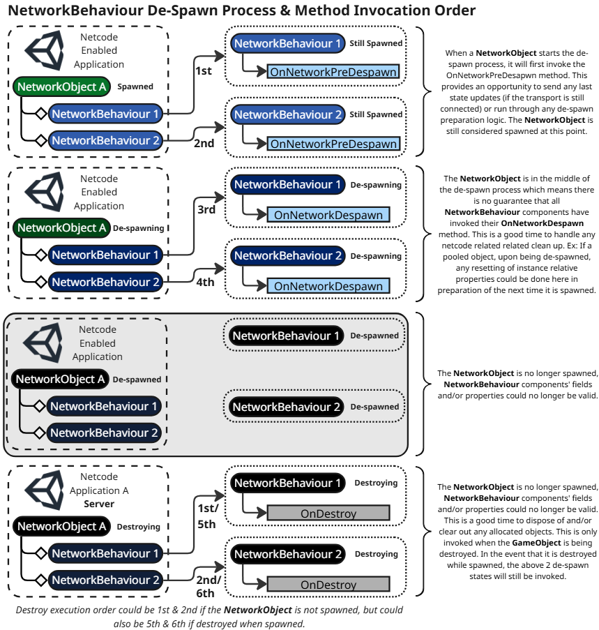

# NetworkBehaviour spawning and despawning

[NetworkBehaviour](https://docs.unity3d.com/Packages/com.unity.netcode.gameobjects@latest?subfolder=/api/Unity.Netcode.NetworkBehaviour.html) is an abstract class that derives from [MonoBehaviour](https://docs.unity3d.com/ScriptReference/MonoBehaviour.html) and is primarily used to create unique netcode or game logic. To replicate any netcode-aware properties or send and receive RPCs, a [GameObject](https://docs.unity3d.com/Manual/GameObjects.html) must have a [NetworkObject](networkobject.md) component and at least one NetworkBehaviour component.

A NetworkBehaviour requires a NetworkObject component on the same relative GameObject or on a parent of the GameObject with the NetworkBehaviour component assigned to it. If you add a NetworkBehaviour to a GameObject that doesn't have a NetworkObject (or any parent), then Netcode for GameObjects automatically adds a NetworkObject component to the GameObject in which the NetworkBehaviour was added.

NetworkBehaviours can use `NetworkVariable`s and RPCs to synchronize states and send messages over the network. When you call an RPC function, the function isn't called locally. Instead, a message is sent containing your parameters, the `networkId` of the NetworkObject associated with the same GameObject (or child) that the NetworkBehaviour is assigned to, and the index of the NetworkObject-relative NetworkBehaviour (NetworkObjects can have several `NetworkBehaviours`, the index communicates which one).

For more information about serializing and synchronizing NetworkBehaviours, refer to the [NetworkBehaviour synchronization page](networkbehaviour-synchronize.md).

> [!NOTE]
> It's important that the NetworkBehaviours on each NetworkObject remain the same for the server and any client connected. When using multiple projects, this becomes especially important so the server doesn't try to call a client RPC on a NetworkBehaviour that might not exist on a specific client type (or set a `NetworkVariable` that doesn't exist, and so on).

## Spawning

`OnNetworkSpawn` is invoked on each NetworkBehaviour associated with a NetworkObject when it's spawned. This is where all netcode-related initialization should occur.

You can still use `Awake` and `Start` to do things like finding components and assigning them to local properties, but if `NetworkBehaviour.IsSpawned` is false then don't expect netcode-distinguishing properties (like `IsClient`, `IsServer`, `IsHost`, for example) to be accurate within `Awake` and `Start` methods.

For reference purposes, below is a table of when `NetworkBehaviour.OnNetworkSpawn` is invoked relative to the NetworkObject type:

Dynamically spawned | In-scene placed
------------------- | ---------------
`Awake`               | `Awake`
`OnNetworkSpawn`      | `Start`
`Start`               | `OnNetworkSpawn`

### Spawn process and invocation order

Unity's [event function execution order](https://docs.unity3d.com/Manual/ExecutionOrder.html) and [script execution order](https://docs.unity3d.com/Manual/script-execution-order.html) dictate the order of operations for your component scripts. When you add multiplayer elements to your project, you also need to consider how netcode scripts affect the overall order of operations and script execution order.

For example, NetworkBehaviour includes several virtual methods that are invoked at different spawn stages of a NetworkObject, as represented in the following diagram:



The diagram above represents how the spawn process works for two NetworkBehaviour components, _NetworkBehaviour1_ and _NetworkBehaviour2_. The order of NetworkBehaviour components is defined by their placement in the Inspector view of the Unity Editor, relative to the parent NetworkObject. In this example, _NetworkBehaviour1_ is placed above _NetworkBehaviour2_ in the Inspector view.

NetworkObjects go through three states during the spawn process:

**Spawn states**
- Prespawning: Before any netcode-related properties have been set.
- Spawning: Netcode-related properties have been set.
- Spawned: All NetworkBehaviour components have completed their spawn logic.

For each spawn state there is a corresponding NetworkBehaviour virtual method:

**Spawn state-related methods**
- Prespawning: `NetworkBehaviour.OnNetworkPreSpawn`.
    - Used for any post-serialization configuration that has no dependencies on netcode-related properties. For example, at this stage you don't yet know whether the execution context is a server or client, since `NetworkBehaviour.IsServer` and `NetworkBehaviour.IsClient` have yet to be set. This is why a reference to the NetworkManager is passed into this virtual method.
- Spawning: `NetworkBehaviour.OnNetworkSpawn`
    - Used to handle any NetworkBehaviour-related configurations that depend on serialized states that might have been passed in. Order of operations here is important, since the `OnNetworkSpawn` method of _NetworkBehaviour1_ is invoked before _NetworkBehaviour2_. If _NetworkBehaviour1_ tries to access a field or property of _NetworkBehaviour2_ during its `OnNetworkSpawn` method, it could lead to an order of operations issue, because _NetworkBehaviour2_ hasn't yet set those values.
- Spawned: `NetworkBehaviour.OnNetworkPostSpawn`
    - Any script logic executed here can assume that all properties and fields configured during `OnNetworkSpawn` have been set. At this stage, order of operations issues are no longer a concern, since all `OnNetworkSpawn` methods have completed.

For more information about NetworkBehaviour methods and when they're invoked, refer to the [prespawn and MonoBehaviour methods section](networkbehaviour.md#prespawn-and-monobehaviour-methods).

### Disabling NetworkBehaviours when spawning

If you want to disable a specific NetworkBehaviour but still want it to be included in the NetworkObject spawn process (so you can still enable it at a later time), you can disable the individual NetworkBehaviour instead of the entire GameObject.

NetworkBehaviour components that are disabled by default and are attached to in-scene placed NetworkObjects behave like NetworkBehaviour components that are attached to dynamically spawned NetworkObjects when it comes to the order of operations for the `NetworkBehaviour.Start` and `NetworkBehaviour.OnNetworkSpawn` methods. Since in-scene placed NetworkObjects are spawned when the scene is loaded, a NetworkBehaviour component (that is disabled by default) will have its `NetworkBehaviour.OnNetworkSpawn` method invoked before the `NetworkBehaviour.Start` method, since `NetworkBehaviour.Start` is invoked when a disabled NetworkBehaviour component is enabled.

Dynamically spawned | In-scene placed (disabled NetworkBehaviour components)
------------------- | ---------------
`Awake`               | `Awake`
`OnNetworkSpawn`      | `OnNetworkSpawn`
`Start`               | `Start` (invoked when disabled NetworkBehaviour components are enabled)

> [!NOTE] Parenting, inactive GameObjects, and NetworkBehaviour components
> If you have child GameObjects that are not active in the hierarchy but are nested under an active GameObject with an attached NetworkObject component, then the inactive child GameObjects will not be included when the NetworkObject is spawned. This applies for the duration of the NetworkObject's spawned lifetime. If you want all child NetworkBehaviour components to be included in the spawn process, then make sure their respective GameObjects are active in the hierarchy before spawning the NetworkObject. Alternatively, you can just disable the NetworkBehaviour component(s) individually while leaving their associated GameObject active.
> It's recommended to disable a NetworkBehaviour component rather than the GameObject itself.

### Prespawn and MonoBehaviour methods

Because NetworkBehaviour is derived from [MonoBehaviour](https://docs.unity3d.com/ScriptReference/MonoBehaviour.html), the `NetworkBehaviour.OnNetworkSpawn` method is treated similarly to the `Awake`, `Start`, `FixedUpdate`, `Update`, and `LateUpdate` MonoBehaviour methods. Different methods are invoked depending on whether the GameObject is active in the hierarchy.

- When active: `Awake`, `Start`, `FixedUpdate`, `Update`, and `LateUpdate` are invoked.
- When not active: `Awake`, `Start`, `FixedUpdate`, `Update`, and `LateUpdate` are not invoked.

For more information about execution order, refer to [Order of execution for event functions](https://docs.unity3d.com/Manual/ExecutionOrder.html) in the main Unity Manual.

The unique behavior of `OnNetworkSpawn`, compared to the previously listed methods, is that it's not invoked until the associated GameObject is active in the hierarchy and its associated NetworkObject is spawned.

Additionally, the `FixedUpdate`, `Update`, and `LateUpdate` methods, if defined and the GameObject is active in the hierarchy, will still be invoked on NetworkBehaviours even when they're not yet spawned. If you want some or all of your update methods to only execute when the associated NetworkObject component is spawned, you can use the `NetworkBehaviour.IsSpawned` flag to determine the spawned status like the below example:

```csharp
private void Update()
{
    // If the NetworkObject is not yet spawned, exit early.
    if (!IsSpawned)
    {
        return;
    }
    // Netcode specific logic executed when spawned.
}
```

Alternatively, you can leverage the [NetworkUpdateLoop](../../advanced-topics/network-update-loop-system/index.md) system by making a NetworkBehaviour implement the `INetworkUpdateSystem` interface and register each instance for a specific `NetworkUpdateStage` during the `OnNetworkSpawn` or `OnNetworkPreSpawn` invocations, and then use your own script logic to determine which instance should be updating.

This can be useful when you want only the owner, authority, or non-authority to be updating and can help to remove checks like the above. It can also reduce the performance cost of all instances that do not register for the update stage (depending upon how many instances are spawned).

### Dynamically spawned NetworkObjects

For dynamically spawned NetworkObjects (instantiating a network prefab during runtime) the `OnNetworkSpawn` method is invoked before the `Start` method is invoked. This means that finding and assigning components to a local property within the `Start` method exclusively will result in that property not being set in a NetworkBehaviour component's `OnNetworkSpawn` method when the NetworkObject is dynamically spawned. To circumvent this issue, you can have a common method that initializes the components and is invoked both during the `Start` method and the `OnNetworkSpawned` method like the code example below:

```csharp
public class MyNetworkBehaviour : NetworkBehaviour
{
    private MeshRenderer m_MeshRenderer;
    private void Start()
    {
        Initialize();
    }

    private void Initialize()
    {
        if (m_MeshRenderer == null)
        {
            m_MeshRenderer = FindObjectOfType<MeshRenderer>();
        }
    }

    public override void OnNetworkSpawn()
    {
        Initialize();
        // Do things with m_MeshRenderer

        base.OnNetworkSpawn();
    }
}
```

### In-scene placed NetworkObjects

For in-scene placed NetworkObjects, the `OnNetworkSpawn` method is invoked after the `Start` method, because the SceneManager scene loading process controls when NetworkObjects are instantiated. The previous code example shows how you can design a NetworkBehaviour that ensures both in-scene placed and dynamically spawned NetworkObjects will have assigned the required properties before attempting to access them. Of course, you can always make the decision to have in-scene placed `NetworkObjects` contain unique components to that of dynamically spawned `NetworkObjects`. It all depends upon what usage pattern works best for your project.

## Despawning

When a NetworkObject is despawned, it will first iterate over and invoke `NetworkBehaviour.OnNetworkPreDespawn` and then `NetworkBehaviour.OnNetworkDespawn`for each of its assigned NetworkBehaviours.

- `NetworkBehaviour.OnNetworkPreDespawn`: This is invoked by the associated NetworkObject instance at the very start of the despawn process. The associated NetworkObject is still considered to be spawned at the point which `OnNetworkPreDespawn` is invoked.
- `NetworkBehaviour.OnNetworkDespawn`: This is invoked while the NetworkObject instance is in the middle of the despawn process. The associated NetworkObject is not considered spawned at this stage and there is no guarantee that other NetworkBehaviour components associated with the NetworkObject will have a valid netcode-related state (refer to the [despawn process and invocation order section](#despawn-process-and-invocation-order) for more information).

### Despawning but not destroying

To despawn a NetworkObject without destroying the associated GameObject, you can invoke `NetworkObject.Despawn` and pass in `false` for the `destroy` parameter. This is useful when you want to keep the GameObject instance and its children in the scene for later reuse or respawning.

### Despawning and destroying

There are two ways to despawn a NetworkObject and destroy the associated GameObject:

- When invoking `NetworkObject.Despawn` and either not passing any parameters (the default setting is `destroy`) or passing in `true` for the `destroy` parameter.
- When invoking `GameObject.Destroy` on the GameObject that the NetworkObject component belongs to.
    - This causes `NetworkObject.Despawn` to be invoked first (internally) and then `NetworkObject.OnDestroy` is invoked after that.

Each NetworkBehaviour has a virtual `OnDestroy` method that you can override to manage any clean up that needs to occur when the NetworkBehaviour is being destroyed. However, the base `OnDestroy` method also handles other internal destroy-related clean up tasks, so if you override the virtual `OnDestroy` method it's important to always invoke the base `OnDestroy` method at the end of your script as in the following example:

```csharp
        public override void OnDestroy()
        {
            // Local NetworkBehaviour clean up script here:

            // Invoke the base after local NetworkBehaviour clean up script (last).
            base.OnDestroy();
        }
```

> [!NOTE] Destroying the GameObject
> When destroying a NetworkObject from within an associated NetworkBehaviour component script, you should always destroy the `NetworkObject.gameObject` and not the `NetworkBehaviour.gameObject` in case the NetworkBehaviour is located on a child GameObject nested under the NetworkObject's GameObject.

### Despawn process and invocation order



Similar to the [spawn process and invocation order section above](#spawn-process-and-invocation-order), NetworkBehaviour components break up the despawn process into three states:

**Despawn states**
- Spawned: The NetworkObject starts the frame in this state before any internal despawn script has been invoked. At this stage, the NetworkObject and all NetworkBehaviour components have their netcode-related states intact.
- Despawning: The NetworkObject has begun the despawn process. NetworkBehaviour components might have reset or disposed of certain fields or properties. When the last NetworkBehaviour component has invoked its `OnNetworkDespawn` method, the NetworkObject is considered despawned. If the NetworkObject was despawned but not destroyed, then the GameObject instance persists. If the NetworkObject was despawned and destroyed, then the GameObject instance and all related components are destroyed.
- Despawned: The NetworkObject has finished the despawn process. NetworkBehaviour components might have reset or disposed of certain fields or properties. A local instance can be respawned if the NetworkObject was despawned but not destroyed.

**Despawn state-related methods**
- Spawned: `NetworkBehaviour.OnNetworkPreDespawn`.
- Despawning: `NetworkBehaviour.OnNetworkDespawn`
- Despawned: No state-related method.

## Additional resources

- [NetworkObjects](networkobject.md)
- [NetworkBehaviour synchronization](networkbehaviour-synchronize.md)