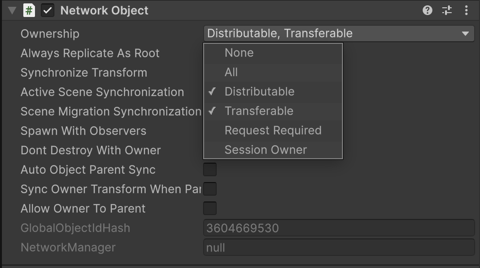

# NetworkObject ownership

Manage NetworkObject ownership across different network topologies.

Before reading these docs, ensure you understand the concepts of [ownership](../../terms-concepts/ownership.md) and [authority](../../terms-concepts/authority.md) within Netcode for GameObjects. It's also recommended to be familiar with the [NetworkObject](./networkobject.md) and [NetworkBehaviour](./networkbehaviour.md). Ownership behaves slightly differently based on your game's chosen [network topology](../../terms-concepts/network-topologies.md).

Read more about how to detect when ownership has changed in [NetworkBehaviour ownership](./networkbehaviour-ownership.md).

## Helpful properties

> [!NOTE]
> All NetworkObject properties are only valid while the NetworkObject is spawned. Use [`NetworkObject.IsSpawned`](https://docs.unity3d.com/Packages/com.unity.netcode.gameobjects@latest?subfolder=/api/Unity.Netcode.NetworkObject.html#Unity_Netcode_NetworkObject_IsSpawned) to check the spawned status of the NetworkObject.

To identify whether the local client is the owner of a NetworkObject, you can check the[`NetworkObject.IsOwner`](https://docs.unity3d.com/Packages/com.unity.netcode.gameobjects@latest?subfolder=/api/Unity.Netcode.NetworkObject.IsOwner.html) or the [`NetworkBehaviour.IsOwner`](https://docs.unity3d.com/Packages/com.unity.netcode.gameobjects@latest?subfolder=/api/Unity.Netcode.NetworkBehaviour.IsOwner.html) property.

To identify whether the server owns a NetworkObject, you can check the [`NetworkObject.IsOwnedByServer`](https://docs.unity3d.com/Packages/com.unity.netcode.gameobjects@latest?subfolder=/api/Unity.Netcode.NetworkObject.IsOwnedByServer.html) or the [`NetworkBehaviour.IsOwnedByServer`](https://docs.unity3d.com/Packages/com.unity.netcode.gameobjects@latest?subfolder=/api/Unity.Netcode.NetworkBehaviour.IsOwnedByServer.html) property.

> [!NOTE]
> To assure a spawned NetworkObject persists after the owner leaves a session, set the `NetworkObject.DontDestroyWithOwner` property to true. This assures the client-owned NetworkObject doesn't get destroyed when the owning client leaves.

## Ownership on spawn

When building a [client-server game](../../terms-concepts/client-server.md), only the server has the authority to spawn objects. In a [distributed authority game](../../terms-concepts/distributed-authority.md), any connected client can spawn objects.

The default `NetworkObject.Spawn` method sets server-side ownership in a client-server topology. When using a distributed authority topology, this method sets the client who calls the method as the owner.

```csharp
var NetworkObject = GetComponent<NetworkObject>.Spawn();
```

## Spawn with ownership

To spawn a NetworkObject that's [owned](../../terms-concepts/ownership.md) by a different game client than the one doing the spawning, use the following:

```csharp
NetworkObject.SpawnWithOwnership(clientId);
```

> [!NOTE]
> Using `SpawnWithOwnership` can result in unexpected behavior when the spawning game client makes any other changes on the object immediately after spawning.

Using `SpawnWithOwnership` and then editing the NetworkObject locally means that the client doing the spawning will behave as the spawn authority. The spawn authority has limited local [authority](../terms-concepts/authority.md) over the NetworkObject, but not [ownership](../terms-concepts/ownership.md) of the NetworkObject that's spawned. This means any owner-specific checks during the spawn sequence will not be invoked on the spawn authority side.

If you want to spawn a NetworkObject for another client and then immediately make adjustments to that NetworkObject, it's recommended to use the `Spawn` method. After adjusting, the spawn authority can immediately follow with a call to `ChangeOwnership`.

```csharp
public class BreakableSpawner : NetworkBehaviour
{
    private GameObject breakablePrefab;

    [Rpc(SendTo.Authority)]
    public void SpawnNewBreakableRpc(RpcParams rpcParams = default) {
        var instance = Instantiate(breakablePrefab).GetComponent<NetworkObject>();
        instance.Spawn();

        // Here we can set the initial values despite the object being owner authoritative.
        instance.transform.position = transform.position;
        instance.GetComponent<Breakable>().RemainingHealth.Value = 20;

        instance.ChangeOwnership(rpcParams.Receive.SenderClientId);
    }
}

public class Breakable : NetworkBehaviour
{
    // Note: This NetworkVariable is owner authoritative
    public NetworkVariable<int> RemainingHealth = new NetworkVariable<int>(writePerm: NetworkVariableWritePermission.Owner);

    public override void OnNetworkSpawn()
    {
        if (IsOwner)
        {
            // SpawnWithOwnership() will not invoke this code on initial spawn.
        }
        base.OnNetworkSpawn();
    }
}
```

This flow allows the spawning client to completely spawn and finish initializing the NetworkObject locally before transferring the ownership to another game client.

## Authority ownership

If you're creating a [client-server](../../terms-concepts/client-server.md) game and you want a client to control more than one NetworkObject, or if you're creating a [distributed authority](../../terms-concepts/distributed-authority.md) game and the authority/current owner of the object would like to change ownership, use the following ownership methods.

To change ownership, the authority uses the `ChangeOwnership` method:

```csharp
NetworkObject.ChangeOwnership(clientId);
```

Use [spawn with ownership](#spawn-with-ownership) to spawn objects for other game clients.

## Client-server ownership

In a client-server game, the server is always the authority of ownership changes. Clients cannot change ownership, the server can interact with ownership as outlined above in [authority ownership](#authority-ownership). Additionally in a client-server game, ownership can be given back to the server using the `RemoveOwnership` method:

```csharp
NetworkObject.RemoveOwnership();
```

## Distributed authority ownership

In a distributed authority topology, the owner of a NetworkObject is always the authority for that NetworkObject. Because the simulation is shared between clients, it's important that ownership can be easily passed between game clients. This enables:

- Evenly sharing the load of the game simulation by redistributing NetworkObjects whenever a player joins or leaves.
- Allowing ownership to be transferred immediately to a client in situations where the client is interacting with that NetworkObject to remove lag from those interactions.
- Controlling when a NetworkObject is safe or valid to be transferred.

The authority of any NetworkObject can always change ownership, as outlined in [authority ownership](#authority-ownership).

### Ownership permission settings

The following ownership permission settings, defined by [`NetworkObject.OwnershipStatus`](https://docs.unity3d.com/Packages/com.unity.netcode.gameobjects@latest?subfolder=/api/Unity.Netcode.NetworkObject.OwnershipStatus.html), control how ownership of NetworkObjects can be changed during a distributed authority session:

|**Ownership setting**|Description|Related Property|Multi-select|
|-----|-----|-----|-----|
|`None`|Ownership of this NetworkObject can't be redistributed, requested, or transferred (a Player might have this, for example).||No|
|`Distributable`|Ownership of this NetworkObject is automatically redistributed when a client joins or leaves, as long as ownership is not locked or a request is pending.|[`IsOwnershipDistributable`](https://docs.unity3d.com/Packages/com.unity.netcode.gameobjects@latest?subfolder=/api/Unity.Netcode.NetworkObject.html#Unity_Netcode_NetworkObject_IsOwnershipDistributable)|**Yes**|
|`Transferable`|Any client can change ownership of this NetworkObject at any time, as long as ownership is not locked or a request is pending.|[`IsOwnershipTransferable`](https://docs.unity3d.com/Packages/com.unity.netcode.gameobjects@latest?subfolder=/api/Unity.Netcode.NetworkObject.html#Unity_Netcode_NetworkObject_IsOwnershipTransferable)|**Yes**|
|`RequestRequired`|Ownership of this NetworkObject must be requested before ownership can be changed.|[`IsOwnershipRequestRequired`](https://docs.unity3d.com/Packages/com.unity.netcode.gameobjects@latest?subfolder=/api/Unity.Netcode.NetworkObject.html#Unity_Netcode_NetworkObject_IsOwnershipRequestRequired), [`IsRequestInProgress`](https://docs.unity3d.com/Packages/com.unity.netcode.gameobjects@latest?subfolder=/api/Unity.Netcode.NetworkObject.html#Unity_Netcode_NetworkObject_IsRequestInProgress)|**Yes**|
|`SessionOwner`|This NetworkObject is always owned by the [session owner](distributed-authority.md#session-ownership) and can't be transferred or distributed. If the session owner changes, this NetworkObject is automatically transferred to the new session owner.|[`IsOwnershipSessionOwner`](Unity_Netcode_NetworkObject_IsOwnershipSessionOwner)|No|

Ownership permissions can be set in the editor using the **Ownership** dropdown.



They can also be set in script using

You can also use `NetworkObject.SetOwnershipLock` to lock and unlock the permission settings of a NetworkObject for a period of time, preventing ownership changes on a temporary basis. The [`IsOwnershipLocked`](https://docs.unity3d.com/Packages/com.unity.netcode.gameobjects@latest?subfolder=/api/Unity.Netcode.NetworkObject.html#Unity_Netcode_NetworkObject_IsOwnershipLocked) property can be used to detect if an object has locked ownership.

```csharp
// To lock an object from any ownership changes
NetworkObject.SetOwnershipLock(true);

// To unlock an object so that the underlying ownership permissions apply again
NetworkObject.SetOwnershipLock(false);
```

### Changing ownership in distributed authority

When a NetworkObject is set with `OwnershipPermissions.Transferable` any client can change ownership to any other client using the `ChangeOwnership` method:

```csharp
NetworkObject.ChangeOwnership(clientId);

// To change ownership to self
NetworkObject.ChangeOwnership(NetworkManager.LocalClientId);
```

When a non-authoritative game client calls `ChangeOwnership`, the ownership change can fail. On a failed attempt to change ownership, the `OnOwnershipPermissionsFailure` callback will be invoked with a [`NetworkObject.OwnershipPermissionsFailureStatus`](https://docs.unity3d.com/Packages/com.unity.netcode.gameobjects@latest?subfolder=/api/Unity.Netcode.NetworkObject.OwnershipPermissionsFailureStatus.html) to give information on the failure.

```csharp
/*
* When the NetworkObject's permissions includes the OwnershipPermissions.Transferrable flag.
*/
public class ChangeOwnershipBehaviour : NetworkBehaviour
{
    public override void OnNetworkSpawn()
    {
      NetworkObject.OnOwnershipPermissionsFailure += OnOwnershipPermissionsFailure;
      base.OnNetworkSpawn();
    }

    public void TakeOwnership()
    {
        if (!IsOwner) {
            NetworkObject.ChangeOwnership(NetworkManager.LocalClientId);
        }
    }

    // Override this method on the NetworkBehaviour to detect ownership changes
    protected override void OnOwnershipChanged(ulong previous, ulong current)
    {
        if (IsOwner)
        {
            // If this is invoked, then the ownership change succeeded!
        }
        base.OnOwnershipChanged(previous, current);
    }

    private void OnOwnershipPermissionsFailure(NetworkObject.OwnershipPermissionsFailureStatus ownershipPermissionsFailureStatus)
    {
        // If this is invoked then the ownership change failed.
    }

    public override void OnNetworkDespawn()
    {
        NetworkObject.OnOwnershipPermissionsFailure += OnOwnershipPermissionsFailure;
        base.OnNetworkDespawn();
    }
}
```

### Requesting ownership in distributed authority

When a NetworkObject is set with `OwnershipPermissions.RequestRequired` any client can request the ownership for themselves using the `RequestOwnership` method:

```csharp
var requestStatus = NetworkObject.RequestOwnership();
```

`RequestOwnership` returns an [`OwnershipRequestStatus`](https://docs.unity3d.com/Packages/com.unity.netcode.gameobjects@latest?subfolder=/api/Unity.Netcode.NetworkObject.OwnershipRequestStatus.html) to indicate the initial status of the request. To view the result of the request, the `OnOwnershipRequestResponse` callback will be invoked with a [`NetworkObject.OwnershipRequestResponseStatus`](https://docs.unity3d.com/Packages/com.unity.netcode.gameobjects@latest?subfolder=/api/Unity.Netcode.NetworkObject.OwnershipRequestResponseStatus.html).

By default, any requests for ownership will automatically be approved. To control which client is approved for ownership, use the [`OnOwnershipRequested`](https://docs.unity3d.com/Packages/com.unity.netcode.gameobjects@latest?subfolder=/api/Unity.Netcode.NetworkObject.html#Unity_Netcode_NetworkObject_OnOwnershipRequested) callback

```csharp
/*
* When the NetworkObject's permissions includes the OwnershipPermissions.RequestRequired flag.
*/
public class RequestableOwnershipBehaviour : NetworkBehaviour
{
    public override void OnNetworkSpawn()
    {
        NetworkObject.OnOwnershipRequested += OnOwnershipRequested;
        NetworkObject.OnOwnershipRequestResponse += OnOwnershipRequestResponse;
        base.OnNetworkSpawn();
    }

    public void TakeOwnership()
    {
        if (IsOwner)
        {
            return;
        }

        var requestStatus = NetworkObject.RequestOwnership();
        if (requestStatus == NetworkObject.OwnershipRequestStatus.RequestSent)
        {
            // Request was sent to the owning client!
        }
        else
        {
            // Request failed to send. Use the requestStatus variable to investigate the failure to send.
        }
    }

    private bool OnOwnershipRequested(ulong requestingClientId)
    {
        // The existing owner of the object can use this callback to choose whether the request is accepted.
        return true;
    }

    private void OnOwnershipRequestResponse(NetworkObject.OwnershipRequestResponseStatus ownershipRequestResponseStatus)
    {
        if (ownershipRequestResponseStatus == NetworkObject.OwnershipRequestResponseStatus.Approved)
        {
            // The ownership request was approved and current client now owns this object!
        }
        else
        {
            // The ownership request either failed or was denied. Use the ownershipRequestResponseStatus variable to investigate the failure.
        }
    }

    public override void OnNetworkDespawn()
    {
        NetworkObject.OnOwnershipRequested -= OnOwnershipRequested;
        NetworkObject.OnOwnershipRequestResponse -= OnOwnershipRequestResponse;
        base.OnNetworkDespawn();
    }
}
```

## Additional resources

- [NetworkObject](../components/core/networkobject.md)
- [NetworkBehaviour](./networkbehaviour.md)
- [NetworkBehaviour ownership](./networkbehaviour-ownership.md)
- [Ownership](../terms-concepts/ownership.md)
- [Authority](../terms-concepts/authority.md)
