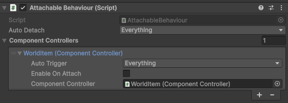
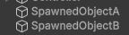
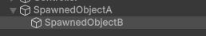
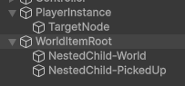
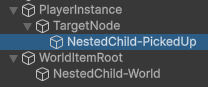
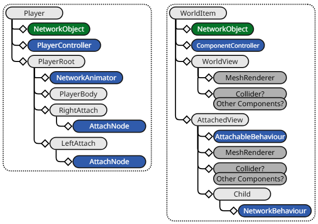
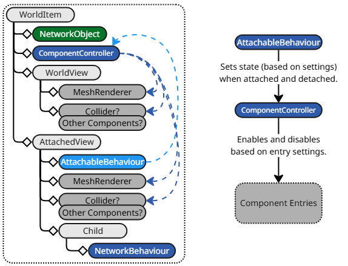
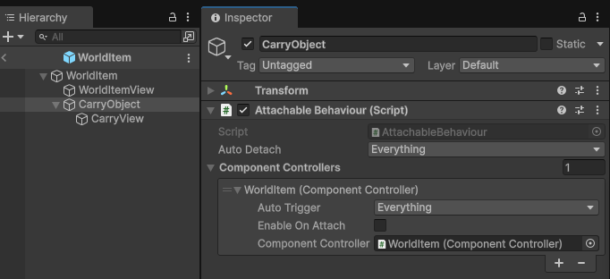
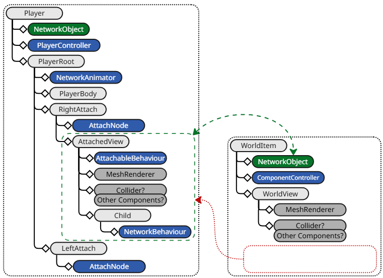

# AttachableBehaviour

Use the AttachableBehaviour component to manage [ComponentController](componentcontroller.md) components and to attach a child GameObject to an [AttachableNode](attachablenode.md). The AttachableBehaviour component provides an alternative to NetworkObject parenting, allowing you to attach and detach child objects dynamically during runtime.

The basic functionality of the AttachableBehaviour component provides:

- The ability to assign ComponentController components from any part of the parent-child hierarchy.
  -  Each **Component Controller** entry provides the ability to select when the ComponentController should be triggered (via the **Auto Trigger** property) and whether its enabled state should be enabled or disabled  upon attaching (via the **Enable On Attach** property). The default setting is to be disabled when the AttachableBehaviour attaches to an AttachableNode and enabled when detaching. When the **Enable On Attach** property is enabled, the ComponentController is enabled when the AttachableBehaviour attaches to an AttachableNode and disabled when detaching.
- The ability to control when an AttachableBehaviour component will automatically detach from an AttachableNode via the **Auto Detach** property.
    - The **Auto Detach** property can have any combination of the following flags or none (no flags):
         - **On Ownership Changed:** When ownership changes, the AttachableBehaviour will detach from any AttachableNode it's attached to.
        - **On Despawn:**  When the AttachableBehaviour is despawned, it will detach from any AttachableNode it's attached to.
        - **On Attach Node Destroy**: Just before the AttachableNode is destroyed, any attached AttachableBehaviour with this flag will automatically detach from the AttachableNode.

Any of the `AttachableBehaviour.AutoDetach` settings will be invoked on all instances without the need for the owner to synchronize the end result (by detaching), which provides a level of redundancy for edge case scenarios like a player being disconnected abruptly by the host, timing out, or any scenario where a spawned object is being destroyed with the owner (or perhaps being redistributed to another client authority in a [distributed authority](../../terms-concepts/distributed-authority.md) session). Having the ability to select or deselect any of the auto-detach flags coupled with the ability to derive from AttachableBehaviour provides additional levels of modularity and customization.

## Attaching and NetworkObject parenting

Fundamentally, attaching is an alternative method of synchronizing parenting that doesn't involve traditional [NetworkObject parenting](../../advanced-topics/networkobject-parenting.md). Attaching a child GameObject nested under a NetworkObject only takes the child GameObject and parents it under the GameObject of an AttachableNode. The target to parent under must be of a different spawned NetworkObject and the AttachableNode needs to be on the same or child GameObject of the target NetworkObject.

### NetworkObject parenting

The traditional approach is to spawn two NetworkPrefabs instances:

Then parent one instance under the other:

This is simple enough for many scenarios, but can become cumbersome in situations where you might want to have a world version of the item and a picked up version of the item.

### Attaching

When attaching, you create nested GameObject children that represent the item when it's picked up and when it's placed somewhere in the world, effectively creating a GameObject for each item state.

- The WorldItemRoot is where the NetworkObject component is placed.
- The NestedChild-World contains the components needed for the item when it's placed in the world.
- The NestedChild-PickedUp contains the components needed for the item when it's picked up by a player.

By placing an AttachableBehaviour component on the NestedChild-PickedUp GameObject and an AttachableNode component on the TargetNode, a user can then invoke the `AttachableBehaviour.Attach` method while passing in the AttachableNode component and the NestedChild-PickedUp GameObject will get parented under the TargetNode while also synchronizing this action with all other clients.

## AttachableBehaviour example

### Introduction

This example walks through a common scenario where you want to have a world item that has unique visual and scripted components active while placed in the world, but that switches to a different set of visual and scripted components when picked up by a player's avatar. It also covers attaching only the portion of the item that is active when picked up to one of the player's avatar's child nodes.

Below is a high-level diagram overview of what both the player and world item NetworkPrefabs could look like:

#### Player

The player prefab in the above diagram is not complete, and only includes the components relevant to this example plus some additional children and components for example purposes. The AttachableNode components provide an attachment point that any other spawned network prefab with an AttachableBehaviour could attach itself to.

#### WorldItem

This diagram has more detail and introduces one possible method of using a ComponentController and AttachableBehaviour. The ComponentController is used to control the enabling and disabling of components and synchronizing this with non-authority instances. The AttachableBehaviour resides on the child AttachedView's GameObject and is the catalyst for attaching to a player.

### WorldView and AttachedView modes

The diagram above has arrows pointing from the ComponentController to the components that are enabled or disabled depending on the ComponentController's state. These are components that are only relevant when the item is in the world (WorldView mode) or when it's attached to a player (AttachedView mode).

The AttachableBehaviour also has an arrow that points to the ComponentController, indicating a relationship between the two. The right-hand diagram indicates the flow of events: the AttachableBehaviour notifies the ComponentController that an item has been attached or detached and the ComponentController, in turn, enables or disables certain components.

#### WorldItem ComponentController

Below is a screenshot of what the ComponentController would look like in the Inspector view:

The ComponentController's **Components** list has three entries, two of which have references to the WorldItemView's BoxCollider and MeshRenderer that are both configured to be enabled when the ComponentController's state is `true`. There's also the CarryView's MeshRenderer that is added and configured to be the inverse of the current ComponentController's state.

 The ComponentController's **Start Enabled** property is enabled, which means that the WorldItem NetworkPrefab starts with the WorldItemView being active when spawned.

The CarryObject child's properties are as follows:

The AttachableBehaviour's **Component Controllers** list contains the WorldItem ComponentController that's configured to trigger on everything (`OnAttach` and `OnDetach`) and sets the ComponentController's state to disabled (`false`). This means that when the AttachableBehaviour is attached, the ComponentController is in the disabled state along with the WorldItemView components, while the CarryView's MeshRenderer will be enabled.

#### Summary

- AttachableBehaviour sets the ComponentController state (true/enabled or false/disabled).
-  ComponentController states:
    - Enabled (true)
        - World Item View (enabled/true)
        - Carry View (disabled/false)
    - Disabled (false)
        - World Item View (disabled/false)
        - Carry View (enabled/true)

### Attaching

The above diagram represents what the Player and WorldItem spawned objects (including non-authority instances) look like once the AttachedView object has been parented under the avatar's RightAttach object. The green area and arrow represent the still existing relationship that the AttachedView has with the WorldItem's NetworkObject.

#### AttachableBehaviour and NetworkObject relationship

When a NetworkObject component is spawned, it registers all NetworkBehaviour-based component instances that are directly attached to the NetworkObject's GameObject or that are on any child GameObject. This remains true even when a child GameObject containing one or more NetworkBehaviour-based component instances of a spawned NetworkObject is parented, during runtime, under another GameObject that is associated with a different spawned NetworkObject.

There are additional considerations like:

- What happens when one or both of the NetworkObjects is despawned?
- How do you ensure the child attachable will return back to its default parent?

AttachableBehaviour addresses these issues by leveraging the spawn lifetime relationship to provide another type of parenting (attaching) while also taking into consideration edge case scenarios.

## Additional resources

- [AttachableNode](attachablenode.md)
- [ComponentController](componentcontroller.md)