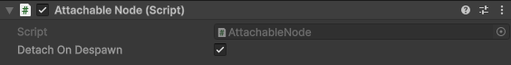

# AttachableNode

Use an AttachableNode component to provide an attachment point for an [AttachableBehaviour](attachablebehaviour.md) component.

AttachableNodes include a **Detach On Despawn** field that, when enabled (the default setting), automatically detaches and destroys any attached AttachableBehaviour instances when the associated NetworkObject of the AttachableNode is despawned.

## AttachableBehaviour example

Refer to the [AttachableBehaviour example](attachablebehaviour.md#attachablebehaviour-example) for an example of how to use the AttachableNode component with an AttachableBehaviour component.

## Additional resources

- [AttachableBehaviour](attachablebehaviour.md)
- [ComponentController](componentcontroller.md)