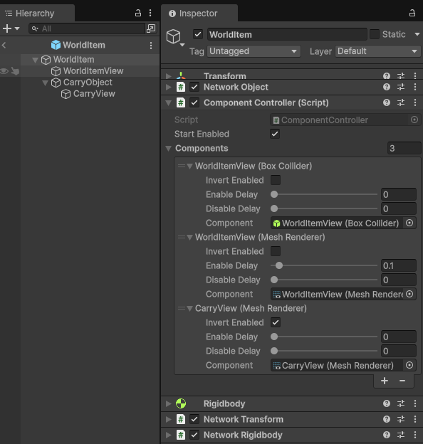

# ComponentController

Use a [ComponentController](https://docs.unity3d.com/Packages/com.unity.netcode.gameobjects@latest?subfolder=/api/Unity.Netcode.ComponentController.html) component to enable or disable one or more components depending on the authority state of the ComponentController and have those changes synchronized with non-authority instances.

For example, you can use a ComponentController to enable or disable a MeshRenderer component on the owner of the ComponentController instance, while disabling it for all other clients. This is useful for controlling visibility of objects that should only be visible to the owner, such as a player's avatar or a weapon they are holding.

The ComponentController can be:

* Used with an [AttachableBehaviour component](attachablebehaviour.md) or independently for another purpose.
* Configured to directly or inversely follow the ComponentController's current state.
* Configured to have an enable and/or disable delay.
    * Note that when invoked internally by AttachableBehaviour, delays are ignored when an [AttachableNode](attachablenode.md) is being destroyed and the changes are immediate.

ComponentControllers use a [synchronized RPC-driven field approach](#synchronized-rpc-driven-properties) to synchronize the states of the components its controlling. This ensures optimal performance and that the order of operations of changes is relative to other ComponentController or AttachableBehaviour component instances.

## Configuring a ComponentController



A ComponentController can have one or more entries in its **Components** list. Each entry has some additional fields that you can adjust:

- **Invert Enabled:** When enabled, this makes the associated component inversely follow the ComponentController's global enabled state. Use this if you want a set of components to be enabled when the ComponentController component's global enable state is set to `false` and for that same set of components to be disabled when the ComponentController component's global enable state is set to `true`.
- **Enable Delay:** When greater than 0 (the default), the associated component will delay transitioning from a disabled state to an enabled state by the amount of time (in seconds) specified.
- **Disable Delay:** When greater than 0 (the default), the associated component will delay transitioning from an enabled state to a disabled state by the amount of time (in seconds) specified.
- **Component:** The component to control and synchronize its enabled state.

You can use the delay values to, for example, prevent a MeshRenderer from being enabled prior to other events (such as while waiting for the attachable to be positioned). The ComponentController automatically handles the synchronization of these delays across the network, ensuring that all clients see the same behavior.

## Examples

### Independent usage

A ComponentController can be [used with an AttachableBehaviour](#attachablebehaviour-usage) without writing any scripts, but you can also write scripts to use it independently. Below is a pseudo example where a ComponentController has its synchronized state updated when the `DaisyChainedController` is either enabled or disabled.

```csharp
/// <summary>
/// Use as a component in the ComponentController that will
/// trigger the Controller (ComponentController).
/// This pattern can repeat/be daisy chained.
/// </summary>
public class DaisyChainedController : MonoBehaviour
{
    public ComponentController Controller;

    private void OnEnable()
    {
        if (!Controller || !Controller.HasAuthority)
        {
            return;
        }
        Controller.SetEnabled(true);
    }

    private void OnDisable()
    {
        if (!Controller || !Controller.HasAuthority)
        {
            return;
        }
        Controller.SetEnabled(false);
    }
}
```

The above component could be arranged to create a chained sequence of components when the root `DaisyChainedController` component is enabled or disabled. Such a sequence could look like:

- DaisyChainedController-A
  - Controller
    - Points to DaisyChainedController-B
- DaisyChainedController-B
  - Controller
    - Points to DaisyChainedController-C
- DaisyChainedController-C
  - Controller

When DaisyChainedController-A is enabled, then a sequence of events would occur where DaisyChainedController-B and DaisyChainedController-C would be enabled. The same sequence of events would occur when DaisyChainedController-A was then disabled.

### AttachableBehaviour usage

An [AttachableBehaviour component](attachablebehaviour.md) can be assigned one or more ComponentControllers that will be invoked, depending on configuration, when the AttachableBehaviour is attached and detached from an [AttachableNode](attachablenode.md).

For more information, refer to the [AttachableBehaviour example](attachablebehaviour.md#attachablebehaviour-example).

## Synchronized RPC-driven properties

Both AttachableBehaviour and ComponentController provide an example of using synchronized RPC-driven properties instead of [NetworkVariables](../../basics/networkvariable.md). Under certain conditions, it can be preferable to use RPCs when a specific order of operations is needed, because NetworkVariables can update out of order (relative to the order in which certain states were updated) in some edge case scenarios.

Under such conditions, using reliable RPCs ensures that messages are received in the order they're generated, while also reducing the latency time between the change and non-authority instances being notified of the change. Synchronized RPC-driven properties only require overriding the `NetworkBehaviour.OnSynchronize` method and serializing any properties that need to be synchronized with late joining players or handling network object visibility related scenarios.

For more information, refer to [NetworkBehaviour synchronization page](../core/networkbehaviour-synchronize.md#synchronized-rpc-driven-fields).

## Additional resources

- [AttachableBehaviour](attachablebehaviour.md)
- [AttachableNode](attachablenode.md)