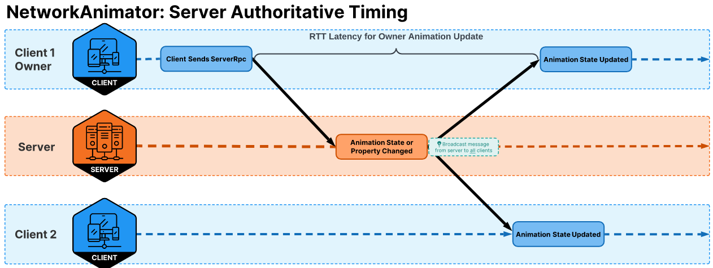
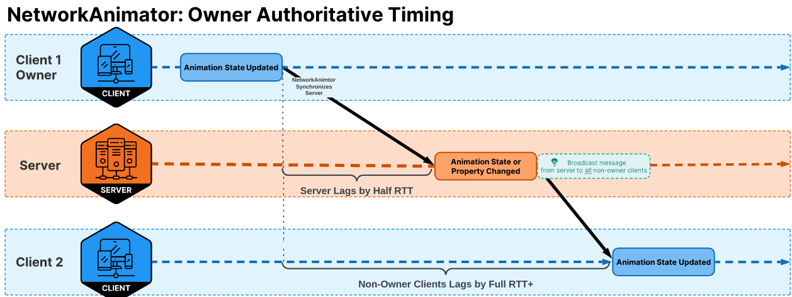
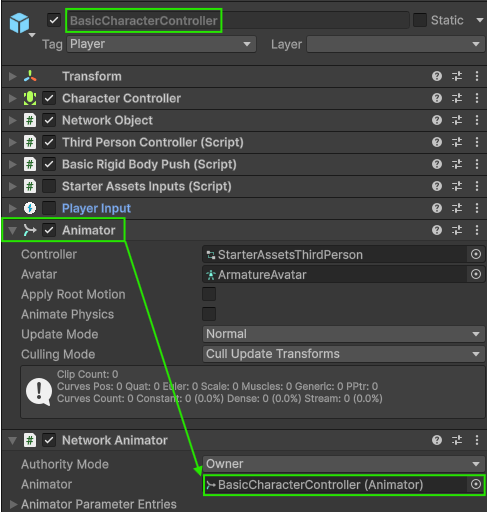
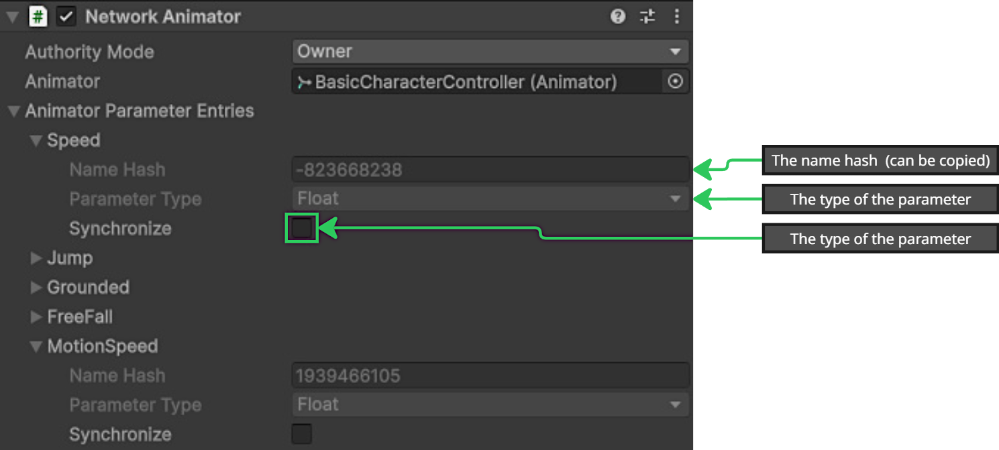
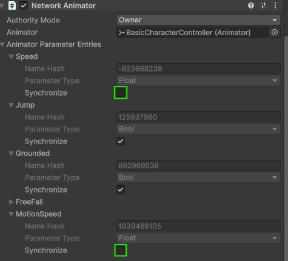

# NetworkAnimator

Use the NetworkAnimator component to synchronize animations during a network session.

When using the [NetworkAnimator](xref:Unity.Netcode.Components.NetworkAnimator) component, [Animator](https://docs.unity3d.com/Documentation/ScriptReference/Animator.html) animation states are synchronized with players joining an existing network session and any client already connected when the animation state changes. You can also use the NetworkAnimator component as an example of how to create your own custom animation synchronization system.

## NetworkAnimator overview

 Players joining an existing network session are synchronized with:

* All the Animator's current parameters and states, with the following exceptions:
  * Animator trigger parameters. These are only synchronized with already connected clients. Late joining clients are synchronized with the Animator's current state.
  * Any Animator parameter specifically excluded from being synchronized.
* Any in progress transition.

Players already connected are synchronized with changes to Animator:

* States
* Transitions
* Parameters
  * NetworkAnimator only synchronizes parameters that have changed since the previous frame's parameter values.
  * Because triggers are similar to an event, when an Animator parameter is set to `true` it will always be synchronized.

> [!NOTE]
> You need to include `Unity.Netcode.Components` as a using directive to reference components such as NetworkAnimator.

## Authority modes

NetworkAnimator can operate in two authority modes:

* [Server authoritative (default)](#server-authoritative-mode): The server dictates changes to Animator state(s) and parameters.
  * Owners can still invoke `NetworkAnimator.SetTrigger`.
* [Owner authoritative](#owner-authoritative-mode): The owner of the spawned NetworkObject dictates changes to Animator state(s) and parameters.

### Server authoritative mode

The default setting for NetworkAnimator is server authoritative mode. When operating in server authoritative mode, any animation state changes that are set (triggers) or detected (changes in layer, state, or any Animator parameters excluding triggers) on the server side will be synchronized with all clients. Because the server initiates any synchronization of changes to an Animator's state, the owner of the NetworkObject associated with the NetworkAnimator can lag by roughly the full round-trip time (RTT). The following timing diagram illustrates this:



A client might be sending the server an RPC to tell the server that the player is performing an action that will change the player's animations (including setting a trigger). In this scenario, the client sends an RPC to the server (half RTT), the server processes the RPC, the associated Animator state changes are detected by the NetworkAnimator (server-side), and then all clients (including the owning client) are synchronized with the changes.

| Server authoritative mode benefits | Server authoritative mode drawbacks |
|------------|--------------------------------|
| If you're running a non-host server, this model reduces the synchronization latency between all client animations. | Hosts will always be slightly ahead of all other clients, which may or may not be an issue depending on the needs of your project. |
|  | Client owners will experience a latency between performing an action (moving, picking something up, anything that causes an Animator state change) and seeing the corresponding animation update. |

### Owner authoritative mode

Your project's design (or personal preference) might require that owners are immediately updated when any Animator state changes to provide the local player with instantaneous visual (animation) feedback. To create an owner authoritative NetworkAnimator, you need to create a new class that's derived from NetworkAnimator, override the `NetworkAnimator.OnIsServerAuthoritative` method, and return `false` within the overridden `OnIsServerAuthoritative` method as in the following example:

```csharp
    public class OwnerNetworkAnimator : NetworkAnimator
    {
        protected override bool OnIsServerAuthoritative()
        {
            return false;
        }
    }
```

The following diagram illustrates the timing for an owner authoritative NetworkAnimator. While the owner client gets an immediate visual update, non-owner clients end up being roughly one full RTT behind the owner client and a host would be half RTT behind the owner client.



The owner client has an Animator state change that's detected by the NetworkAnimator (`OwnerNetworkAnimator`) which automatically synchronizes the server with the changed state. The server applies the change(s) locally and then broadcasts this state change to all non-owner clients.

| Owner authoritative mode benefits | Owner authoritative mode drawbacks |
|------------|--------------------------------|
| The owner gets instant visual feedback of Animator state changes, which provides a smoother experience for the local player. | Non-owner clients lag behind the owner client's animation by roughly one full RTT. |
|  | The host lags behind the owner client's animation by roughly half RTT. |

> [!NOTE]
> The same rule for setting trigger parameters applies to owner clients. As such, if you want to programmatically set a trigger then you still need to use `NetworkAnimator.SetTrigger`.

## Using NetworkAnimator

Some aspects of how you use NetworkAnimator depends on which authority model you're using: server authoritative or owner authoritative.

> [!NOTE]
> NetworkAnimator is one of several possible ways to synchronize animations during a network session. Netcode for GameObjects provides you with the building blocks (RPCs, NetworkVariables, and custom messages) required to create a custom animation synchronization system to suit your needs. NetworkAnimator is an introductory approach provided for users already familiar with the Animator component and might be all that you need, depending on your project's design requirements.

### Changing meshes

When swapping a skinned mesh with another re-parented skinned mesh, invoke the `Rebind` method on the Animator component (`Animator.Rebind()`).

### Assigning the Animator



When adding a NetworkAnimator component to a network prefab, you need to drag the Animator component onto the **Animator** field in the **Inspector** window. The Animator component can be on the root GameObject of the network prefab or a child under the root GameObject.

### Selecting the authority mode

The NetworkAnimator [authority mode](#authority-modes) determines which instance of a spawned network prefab pushes updates to the Animator's state. You can select which authority mode to use from the **Authority Mode** drop-down menu in the **Inspector** window:


Alternatively, you can change the authority mode by deriving from the `NetworkAnimator` class and overriding the `NetworkAnimator.OnIsServerAuthoritative` method, where returning `true` indicates server authoritative mode and returning `false` indicates owner authoritative mode.

> [!NOTE]
> Using `NetworkAnimator.OnIsServerAuthoritative` overrides the NetworkAnimator **Authority Mode** setting specified via the **Inspector** window.

### Changing Animator parameters

You can set all Animator parameters (except for triggers) directly via the Animator class. For example, if you have a jumping animation and need to handle transitioning out of the part of the sequence where the player is falling from the jump (or falling when walking off of the edge of a platform), then you might have a `bool` parameter called `Grounded` that must be set when the player isn't grounded. One way to do this would be to set the value on the authoritative instance (server or owner) as follows:

```csharp
// m_Animator is a reference to the Animator component
m_Animator.SetFloat("Grounded", false);
```

This example works, but ideally you want to pre-calculate the hash value of the parameter's name and use that pre-calculated value to apply updates to parameters. The following provides an example of how you can accomplish this:

```csharp
private int m_GroundedParameterId;
private bool m_WasGrounded;
private Animator m_Animator;
private CharacterController m_CharacterController;

protected override void OnNetworkPreSpawn(ref NetworkManager networkManager)
{
    // Pre-calculate the hash for quick lookup.
    m_GroundedParameterId = Animator.StringToHash("Grounded");
    // Get the CharacterController.
    m_CharacterController = GetComponent<CharacterController>();
}

private void CheckForFalling()
{
    // If the last status of being grounded is not the current.
    if (m_CharacterController.isGrounded != m_WasGrounded)
    {
        // Set the Grounded parameter to match the change in the grounded state.
        m_Animator.SetBool(m_GroundedParameterId, m_CharacterController.isGrounded);
        // Update to be able to detect when it changes back.
        m_WasGrounded = m_CharacterController.isGrounded;
    }
}
```

## Animator trigger parameter

The Animator trigger parameter type is a Boolean value that, when set to `true`, is automatically reset back to `false` after the Animator component has processed the trigger. Usually, a trigger is used to start a transition between Animator layer states and as a way to signal the beginning of an event. Because trigger parameters have this unique behavior, they require you to set the trigger value via the `NetworkAnimator.SetTrigger` method.

> [!NOTE]
> If you set a trigger parameter using `Animator.SetTrigger` then this trigger sequence won't be properly synchronized with non-authority instances. You must use `NetworkAnimator.SetTrigger` to ensure proper synchronization.

For example, you might have a trigger parameter called `IsJumping` to start a blended transition between the player's walking animation and the jumping animation. The following script adds `m_NetworkAnimator`, which is assigned during `OnNetworkPreSpawn` (unless you need to access it in `Start`, it's recommended to handle getting components within `OnNetworkPreSpawn` because it's invoked prior to `Start` when first spawning an instance).

```csharp
private int m_GroundedParameterId;
private int m_JumpingParameterId;
private bool m_WasGrounded;
private Animator m_Animator;
private NetworkAnimator m_NetworkAnimator;
private CharacterController m_CharacterController;

protected override void OnNetworkPreSpawn(ref NetworkManager networkManager)
{
    // Pre-calculate the hash values for performance purposes.
    m_GroundedParameterId = Animator.StringToHash("Grounded");
    m_JumpingParameterId = Animator.StringToHash("IsJumping");

    // Get the CharacterController.
    m_CharacterController = GetComponent<CharacterController>();
    // Get the NetworkAnimator component.
    m_NetworkAnimator = GetComponent<NetworkAnimator>();
}

private void CheckForFalling()
{
    // If the last status of being grounded is not the current.
    if (m_CharacterController.isGrounded != m_WasGrounded)
    {
        // Set the Grounded parameter to match the change in the grounded state.
        m_Animator.SetBool(m_GroundedParameterId, m_CharacterController.isGrounded);
        // Update to be able to detect when it changes back.
        m_WasGrounded = m_CharacterController.isGrounded;
    }
}

public void SetPlayerJumping(bool isJumping)
{
    // You only need to pass in the parameters hash/id to set the trigger
    m_NetworkAnimator.SetTrigger(m_JumpingParameterId);
}
```

## Exclude parameters from synchronization

By default, all parameters within the Animator are marked for synchronization by the NetworkAnimator component. You can exclude parameters from synchronization to help reduce network traffic and improve performance using the **Animator Parameter Entries** field in the **Inspector** window.



For example, if you have a `float` parameter called `Speed` that's updated every frame based on the player's linear velocity, then keeping it synchronized would generate at least one RPC per frame for each spawned authority instance of the network prefab. In a project with many spawned instances, this can lead to excessive network traffic and performance issues, even with Netcode for GameObjects' message batching.

### Unsynchronized parameters

You can update unsynchronized parameters in two ways, depending on your project's needs:

* Synchronize the values using your own custom solution, such as sending the values at a specific interval via RPC or using a [NetworkVariable](../../basics/networkvariable.md) that synchronizes the delt on each network tick.
  * This approach still contributes to bandwidth usage and processing time, but can provide you with the ability to lerp between the previous and current value over (n) period of time.
* Update the parameters locally based on values that you already have access to.
  * This approach doesn't use any bandwidth, but requires some additional scripts.

#### Updating locally

The following example shows how to locally update the `Speed` parameter based on changes to the player's position over time. The scenario:

* You're using a modified version of the `ThirdPersonController`, or a similar approach with two parameters that determine how quickly a player might play a walking or running animation:
  * `Speed` parameter: Updated each frame based on the player's input.
  * `MotionSpeed`: Determines the magnitude of the player's input.
      * Most of the time this ends up being either 1.0 or 0.0 with an analog device, so this example assumes you're not using an analog device to control the amount of speed to apply over time.
* You're using a [NetworkTransform](networktransform.md) to synchronize changes in position and rotation, or you have written your own custom [NetworkBehaviour](../core/networkbehaviour.md) that accomplishes the same thing.
* You have [interpolation](../../learn/clientside-interpolation.md) enabled, or your custom solution uses some form of interpolation where a single state update is applied over (n) period of time (typically a network tick).

Each non-authority instance receives delta transform state updates from the authority instance, so knows when a player is moving. If the player is moving, then animations should be being played based on the speed (linear velocity) of the authority player instance. So it's possible, on the non-authority instance, to calculate some values based on changes to the transform's position on a frame by frame basis. To begin with, mark the two parameters as unsynchronized within the NetworkAnimator's **Animator Parameter Entries** list (for this example):



This means that the authority will no longer send updates to synchronize these values.

Then you need to implement a script that calculates values on non-authority instances based on the non-authority instances movement over time. The following is an example psuedo-script to accomplish this:

```csharp
[Range(0.0001f, 1.0f)]
public float m_NonAuthorityMotionThreshold = 0.01f;
private Vector3 m_LastPosition;
private float m_UnitsPerSecond;
private bool m_WasMoving;

// Can be used to toggle parameter synchronization during runtime
private NetworkVariable<bool> m_SynchronizeSpeedParameter = new NetworkVariable<bool>(false);

protected override void OnNetworkPostSpawn()
{
    _controller.enabled = IsLocalPlayer;
    _hasAnimator = TryGetComponent(out _animator);
    if (IsLocalPlayer)
    {
        // Register the authority for both the Update and PostLateUpdate player loop stages
        // Update used to handle input and apply motion.
        NetworkUpdateLoop.RegisterNetworkUpdate(this, NetworkUpdateStage.Update);

        // PostLateUpdate handles camera rotation adjustments
        NetworkUpdateLoop.RegisterNetworkUpdate(this, NetworkUpdateStage.PostLateUpdate);
        _input.enabled = true;
        _playerInput.enabled = true;
        m_SynchronizeSpeedParameter.Value = false;
        m_NetworkAnimator.EnableParameterSynchronization("Speed", m_SynchronizeSpeedParameter.Value);
        m_NetworkAnimator.EnableParameterSynchronization("MotionSpeed", m_SynchronizeSpeedParameter.Value);
    }
    else
    {
        // When a non-authority instance is spawned, it initializes the last known position
        m_LastPosition = transform.position;

        // Non-authority instances register for the pre-late update to assure any adjustments to
        // position have been applied before calculating the animation speed.
        NetworkUpdateLoop.RegisterNetworkUpdate(this, NetworkUpdateStage.PreLateUpdate);

    }
    base.OnNetworkPostSpawn();
}

public override void OnNetworkPreDespawn()
{
    _controller.enabled = false;
    // Before de-spawning, unregister from all updates for this instance
    NetworkUpdateLoop.UnregisterAllNetworkUpdates(this);
    base.OnNetworkPreDespawn();
}

// This class implements INetworkUpdateSystem
public void NetworkUpdate(NetworkUpdateStage updateStage)
{
    if (!IsSpawned)
    {
        return;
    }

    switch (updateStage)
    {

        case NetworkUpdateStage.Update:
            {
                // Authority only
                AuthorityUpdate();
                break;
            }
        case NetworkUpdateStage.PreLateUpdate:
            {
                if (!m_SynchronizeSpeedParameter.Value)
                {
                    // Non-authority only
                    NonAuthorityUpdate();
                }
                else if (m_WasMoving)
                {
                    // If synchronizing speed and we were moving, then
                    // reset the fields used to calculate speed
                    m_WasMoving = false;
                    m_UnitsPerSecond = 0.0f;
                    _animationBlend = 0.0f;
                    _speed = 0.0f;
                }
                break;
            }
        case NetworkUpdateStage.PostLateUpdate:
            {
                // Authority only
                CameraRotation();
                break;
            }
    }
}

private void NonAuthorityUpdate()
{
    // Get the delta from last frame
    var deltaVector3 = transform.position - m_LastPosition;
    // An approximated calculation of the potential unity world space units per second by getting the quotient of delta time divided into 1. We are only interested in x and z deltas, so use a Vector2, and then obtain the magnitude of the quotient times the Vector2.
    var unitsPerSecond = (new Vector2(deltaVector3.x, deltaVector3.z) * (1.0f / Time.deltaTime)).magnitude;

    // Only trigger when the delta per frame exceeds the non-authority motion threshold
    if (unitsPerSecond > m_NonAuthorityMotionThreshold)
    {
        // if the new delta is > or < the last value stored
        if (unitsPerSecond != m_UnitsPerSecond)
        {
            // Lerp towards the new delta to mock the player input
            m_UnitsPerSecond = Mathf.Lerp(m_UnitsPerSecond, unitsPerSecond, Time.deltaTime * SpeedChangeRate);

            // Clamp to the maximum world space units per second
            m_UnitsPerSecond = Mathf.Clamp(m_UnitsPerSecond, 0.0f, SprintSpeed);

            // round speed to 3 decimal places like it does with player input
            _speed = (float)System.Math.Round(m_UnitsPerSecond, 3);

            // Track that we are now moving
            m_WasMoving = true;
        }
        else
        {
            // Maintain the current speed
            _speed = m_UnitsPerSecond;
        }

        // If we are half of the non-authority motion threshold then come to a stop
        if (_speed < (m_NonAuthorityMotionThreshold * 0.5f))
        {
            _speed = 0f;
            m_UnitsPerSecond = 0f;
            // Reset the magnitude to zero
            _animator.SetFloat(_animIDMotionSpeed, 0.0f);
        }
        else
        {
            // Set maximum magnitude
            _animator.SetFloat(_animIDMotionSpeed, 1.0f);
        }
        // Apply the calculated speed value
        _animator.SetFloat(_animIDSpeed, _speed);

    }
    else if (m_WasMoving)
    {
        // Reset everything until next motion
        m_WasMoving = false;
        _animator.SetFloat(_animIDSpeed, 0.0f);
        _animator.SetFloat(_animIDMotionSpeed, 0.0f);
        m_UnitsPerSecond = 0.0f;
        _animationBlend = 0.0f;
        _speed = 0.0f;
    }
    m_LastPosition = transform.position;
}
```

The pseudo-script works as follows:

* It keeps track of the last known position.
  * This is initialized on non-authority instances during post spawn.
* The delta between the last known position and current position is used to determine what the world units per second would be if the delta was maintained for one second.
* The script then ensures that the (world) units per second exceeds a specific threshold to avoid edge cases.
* If the units per second is larger than the threshold:
  * Lerping from the last known units per second value towards the new/current units per second value.
    * _This handles accelerating towards or away from the current value._
  * Clamp the calculated value to the maximum speed.
  * Round the result and assign it to the `_speed` field (from `ThirdPersonController`).
* Check if the currently known speed is less than a predetermined minimum value.
  * If so, then set the speed and motion speed to zero.
* Update the local Animator's `Speed` and `MotionSpeed` parameters.

The end result is that (NetworkAnimator relative) the only time this particular set up would send RPCs would be if the player jumps or falls, since speed dictates the idle, walking, and running animations:


### Update synchronization status during runtime

You can update the synchronization status of parameters during runtime by invoking `NetworkAnimator.EnableParameterSynchronization`. Perhaps you have a lot of existing network prefab assets that might be too time intensive to adjust or you only want to adjust certain instances.

The following is an example script that does this when the backslash key is pressed:

```csharp
if (Input.GetKeyDown(KeyCode.Backslash))
{
    m_SynchronizeSpeedParameter.Value = !m_SynchronizeSpeedParameter.Value;
    m_NetworkAnimator.EnableParameterSynchronization(_animIDSpeed, m_SynchronizeSpeedParameter.Value);
    m_NetworkAnimator.EnableParameterSynchronization(_animIDMotionSpeed, m_SynchronizeSpeedParameter.Value);
}
```

## Additional resources

- [NetworkAnimator API documentation](xref:Unity.Netcode.Components.NetworkAnimator)
- [Animator component documentation](https://docs.unity3d.com/Documentation/ScriptReference/Animator.html)