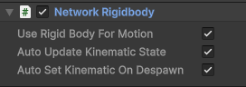
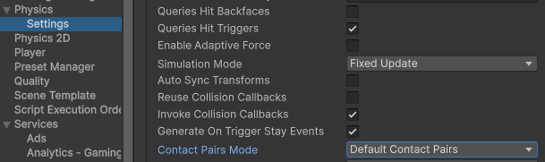
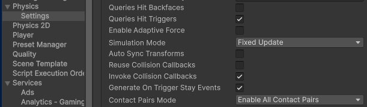

# NetworkRigidbody

NetworkRigidbody is a component that sets the Rigidbody of the GameObject into kinematic mode on all non-authoritative instances. Authority is determined by the [NetworkTransform component](networktransform.md) (required) attached to the same GameObject as the NetworkRigidbody. Whether the NetworkTransform is server authoritative (default) or owner authoritative, the NetworkRigidBody authority model will mirror it. That way, the physics simulation runs on the authoritative instance, and the resulting positions synchronize on the non-authoritative instances, each with their RigidBody being kinematic, without any interference.

## Configure NetworkRigidbody

When looking at a NetworkRigidbody in the Inspector view, there are three exposed values:

- __Use Rigid Body for Motion__
  - When enabled and using a [NetworkTransform](networktransform.md), the NetworkTransform uses the PhysX position and rotation to synchronize changes during the `FixedUpdate` loop update stage.
- __Auto Update Kinematic State__
  - When enabled, NetworkRigidbody automatically determines whether the current instance should be kinematic or non-kinematic.
  - For custom solutions, you can opt to disable this field or derive from [NetworkRigidbodyBase](https://docs.unity3d.com/Packages/com.unity.netcode.gameobjects@2.5/api/Unity.Netcode.Components.NetworkRigidbodyBase.html) and design your own custom networked Rigidbody handler.
- __Auto Set Kinematic On Despawn__
  - When enabled, this option makes the rigid body kinematic when despawned (which can be useful for [object pools](../../advanced-topics/object-pooling.md)).

Some collision events aren't fired when using NetworkRigidBody:

- On the server, all collision and trigger events (such as `OnCollisionEnter`) fire as expected and you can access (and change) values of the `Rigidbody` (such as velocity).
- On clients, Rigidbody is kinematic. Trigger events still fire but collision events won't fire when colliding with other networked Rigidbody instances if your project's physics settings is set to the default contact pairs.

- You can adjust the __Contact Pairs Mode__ to use kinematic and non-kinematic by setting it to __Enable All Contact Pairs__.

> [!NOTE]
> If there's a need for a gameplay event to happen on a collision, you can listen to the `OnCollisionEnter` function on the server and synchronize the event via `Rpc(SendTo.Everyone)` to all clients. If you plan on handling many collisions, then it's recommended to use the [RigidbodyContactEventManager component](https://docs.unity3d.com/Packages/com.unity.netcode.gameobjects@latest?subfolder=/api/Unity.Netcode.Components.RigidbodyContactEventManager.html) to handle collision checking during a job (`OnCollisionenter` can become expensive from a processing perspective if you have enough instances colliding).

### NetworkRigidbody2D

NetworkRigidbody2D works in the same way as NetworkRigidbody but for 2D physics (Rigidbody2D) instead.

## Rigidbody interpolation example

While NetworkTransform offers [interpolation](../../learn/clientside-interpolation.md) as a way to smooth between delta state updates, it doesn't get applied to the authoritative instance. You can use `Rigidbody.interpolation` for your authoritative instance while maintaining a strict server-authoritative motion model.

To have a client control their owned objects, you can use either [RPCs](../../advanced-topics/message-system/rpc.md) or [NetworkVariables](../../basics/networkvariable.md) on the client-side. However, this often results in the host-client's updates working as expected, but with slight jitter when a client sends updates. You might be scanning for key or device input during the `Update` to `LateUpdate` stages. Any input from the host player is applied after the `FixedUpdate` stage (such as physics simulation for the frame has already run), but input from client players is sent via a message and processed, with a half RTT delay, on the host side (or processed 1 network tick + half RTT if using NetworkVariables). Because of when messages are processed, client input updates run the risk of being processed during the `EarlyUpdate` stage which occurs just before the current frame's `FixedUpdate` stage.

To avoid this kind of scenario, it's recommended that you apply any changes received via messages to a Rigidbody after the `FixedUpdate` has run for the current frame. If you [refer to how NetworkTransform handles its changes to transform state](https://github.com/Unity-Technologies/com.unity.netcode.gameobjects/blob/a2c6f7da5be5af077427eef9c1598fa741585b82/com.unity.netcode.gameobjects/Components/NetworkTransform.cs#L3028), you can see that state updates are applied during the `Update` stage, but are received during the `EarlyUpdate` stage. Following this kind of pattern when synchronizing changes to a Rigidbody via messages will help you to avoid unexpected results in your Netcode for GameObjects project.

The best way to address the issue of physics latency is to create a custom NetworkTransform with a custom physics-based interpolator. You can also use the [Network Simulator tool](https://docs.unity3d.com/Packages/com.unity.multiplayer.tools@latest?subfolder=/manual/network-simulator) to spot issues with latency.