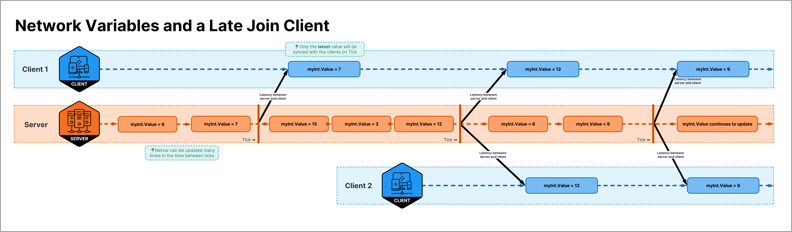
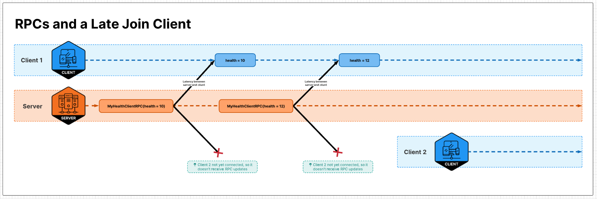
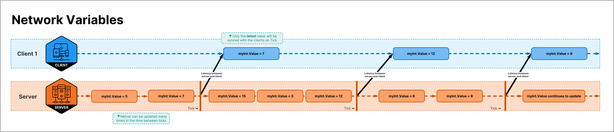
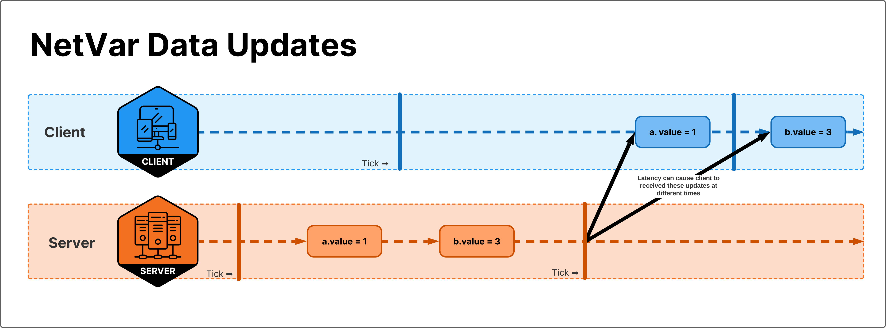
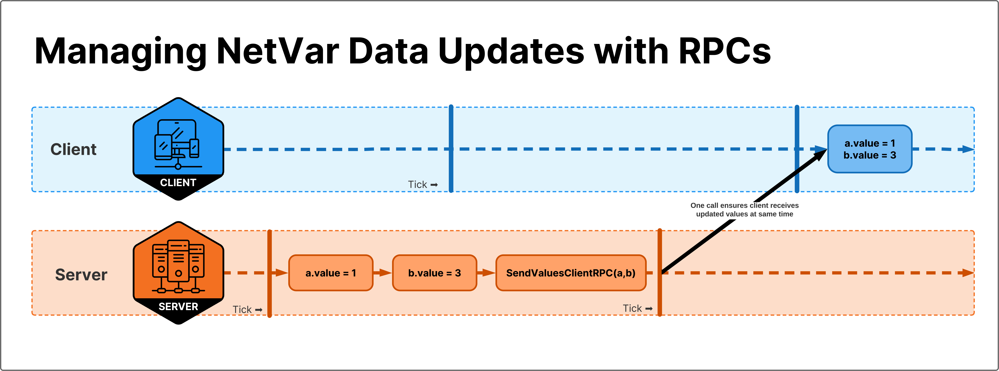

# RPC vs NetworkVariable

Choosing the wrong data syncing mechanism can create bugs, use too much bandwidth, and add too much complexity to your code.
Netcode for GameObjects (Netcode) has two main ways of syncing information between players: RPCs ([Remote Procedure Calls](../advanced-topics/messaging-system.md)) and replicated states [(`NetworkVariable`s)](../basics/networkvariable). They both send messages over the network. The logic and your design around how they send messages is what will make you choose one over the other.

## Choosing between `NetworkVariable`s or RPCs

- Use RPCs for transient events, information only useful for a  moment when it's received.
- Use `NetworkVariable`s for persistent states, for information that will be around more than a moment.

A quick way to choose which to use is to ask yourself: "Should a player joining mid-game get that information?"



Using the Boss Room's door as an example. A player's client needs to receive the information that the door is open to play the right animations.

If we sent an RPC to all clients, then all players connecting mid-game after that RPC is sent will miss that information and have the wrong visual on their clients.



<!-- Commenting this out until we can get external code references working

In that case, it's preferable to use `NetworkVariable`s as show below:

```csharp reference
https://github.com/Unity-Technologies/com.unity.multiplayer.samples.coop/blob/v2.2.0/Assets/Scripts/Gameplay/GameplayObjects/SwitchedDoor.cs#L10-L26
```

It uses a `BoolNetworkVariable` to represent the `IsOpen` state. If one player opens the door and a second player connects after this, the host replicates all the world's information to that new player, including the door's state.

-->

`NetworkVariable`s are eventually consistent. This means not all value changes will be synced, contrary to RPCs, where five calls to an RPC will produce five RPC sends on the network.



`NetworkVariable`s will save on bandwidth for you, making sure to only send values when the data has changed. However, if you want all value changes, RPCs might be best.

## Why not use `NetworkVariable`s for everything?

RPCs are simpler.

If you have a temporary event like an explosion, you don't need a replicated state for this. It would not make sense. You would have an "unexploded" state that would need to be synced every time a new player connected? From a design perspective, you might not want to represent these events as state.

An explosion can use an RPC for the event, but the effect of the explosion should be using `NetworkVariable`s (for example player's knockback and health decrease). A newly connected player doesn't care about an explosion that happened five seconds ago. They do care about the current health of the players around that explosion though.

<!-- Commenting this out until we can get external code references working

Actions in Boss Room are a great example for this. The area of effect action (`AoeAction`) triggers an RPC when the action is activated (showing a VFX around the affected area). The imp's health (`NetworkVariable`s) is updated. If a new player connects, they will see the damaged imps. We would not care about the area of effect ability's VFX, which works great with a transient RPC.

`AoeActionInput.cs` Shows the input being updated client side and not waiting for the server. It then calls an RPC when clicking on the area to affect.

```csharp reference
https://github.com/Unity-Technologies/com.unity.multiplayer.samples.coop/blob/v2.2.0/Assets/Scripts/Gameplay/Action/Input/AoeActionInput.cs
```

`AOEAction.cs` has server-side logic detecting enemies inside the area and applying damage. It then broadcasts an RPC to tell all clients to play the VFX at the appropriate position. Character's state will automatically update with their respective `NetworkVariable`s update (health and alive status for example).

```csharp reference
https://github.com/Unity-Technologies/com.unity.multiplayer.samples.coop/blob/v2.2.0/Assets/Scripts/Gameplay/Action/ConcreteActions/AOEAction.cs#L8-L-40
```

The following snippet of code is triggered by an RPC coming from the server

```csharp reference
https://github.com/Unity-Technologies/com.unity.multiplayer.samples.coop/blob/v2.2.0/Assets/Scripts/Gameplay/Action/ConcreteActions/AOEAction.cs#L77-L82
```
-->

If you want to make sure two variables are received at the same time, RPCs are great for this.

If you change `NetworkVariables` "a" and "b", there is no guarantee they will both be received client side at the same time.



Sending them as two parameters in the same RPC ensures they will be received at the same time client side.



`NetworkVariable`s are great when you only care about the latest value.

## Summary

`NetworkVariable`s are great for managing state, to make sure everyone has the latest value. Use them when you want to make sure newly connected players get an up to date world state.

RPCs are great for sending transient events. Use them when transmitting short-lived events.
