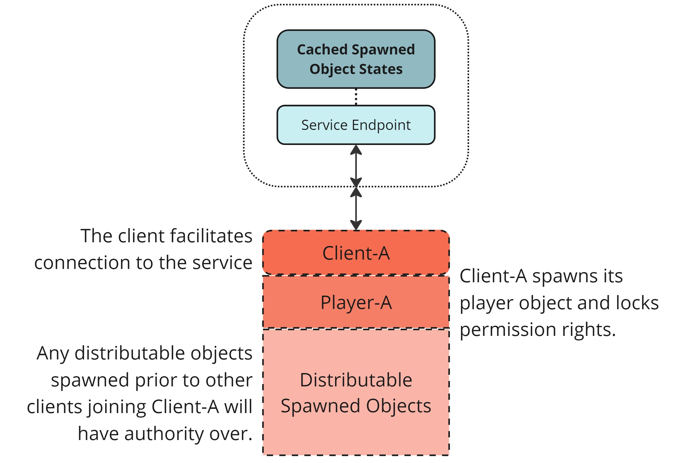
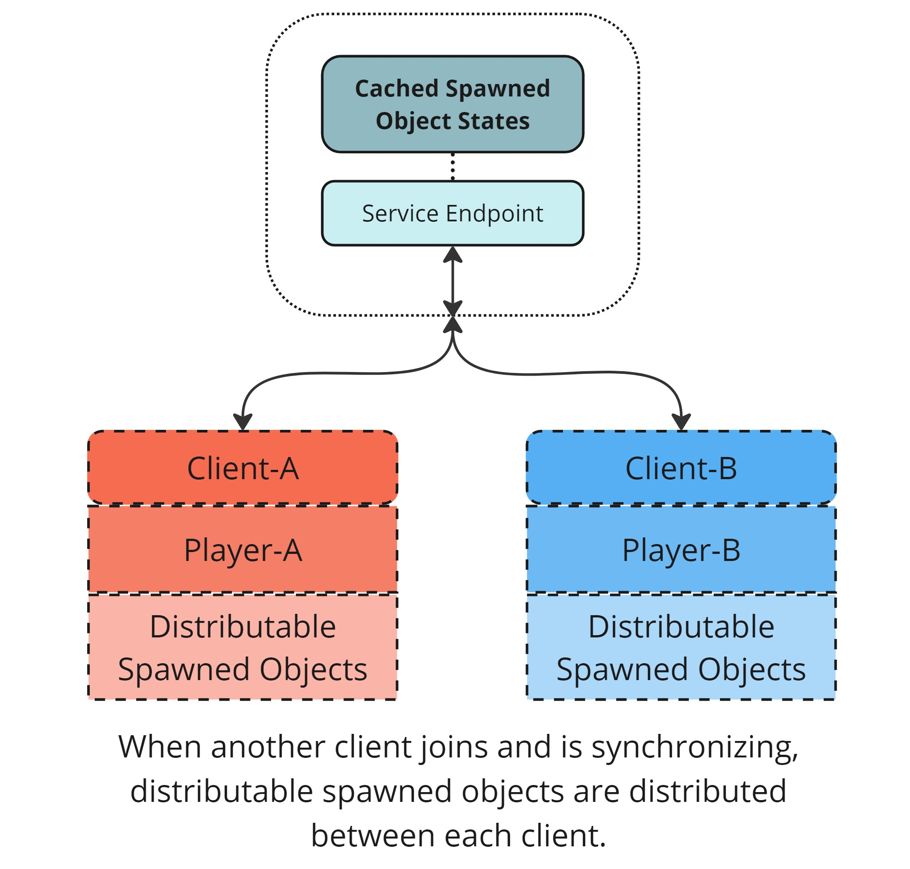

# Distributed authority topologies

The [distributed authority network topology](network-topologies.md#distributed-authority) is one possible [network topology](network-topologies.md) available within Netcode for GameObjects. Distributed authority games use the [distributed authority model](authority.md#distributed-authority).

The traditional [client-server network topology](network-topologies.md#client-server) has a dedicated game instance running the game simulation. This means all state changes must be communicated to the server and then the server communicates those updates to all other connected clients. This design works well when using a powerful dedicated game server, however significant latencies are added when communicating state changes with a [listen server architecture](../learn/listenserverhostarchitecture.md).

> [!NOTE]
> The distributed authority service provided by the [Multiplayer Services package](https://docs.unity.com/ugs/en-us/manual/mps-sdk/manual) has a free tier for bandwidth and connectivity hours, allowing you to develop and test without immediate cost. Refer to the [Unity Gaming Services pricing page](https://unity.com/products/gaming-services/pricing) for complete details.

## Considerations

Using a distributed authority topology is typically not suitable for high-performance competitive games that require an accurate predictive motion model. The distributed authority model successfully addresses a lot of visual and input-related issues, but does have some limitations:

* Because [authority](./authority.md) of NetworkObjects is distributed across clients, there's typically no single physics simulation governing the interaction of all objects. This can require approaching physics-related gameplay differently compared to a traditional client-server context.* Depending on the platform and design of your product, it can be easier for bad actors to cheat. The authority model gives more trust to individual clients. Evaluate your cheating tolerance when developing with distributed authority.

## Session ownership

When using the distributed authority topology, it's necessary to have a single dedicated client that's responsible for managing and synchronizing global game state-related tasks. This client is referred to as the session owner.

The initial session owner is the first client that joins when the session is created. If this client disconnects during the game, a new session owner is automatically selected and promoted from within the clients that are currently connected.

The session owner is the client responsible for loading and unloading scenes, as well as synchronizing any existing game state to late-joining clients. Other connected clients synchronize any NetworkObjects where the session owner doesn't have [visibility](../basics/object-visibility.md).

### `IsSessionOwner`

To determine if the current client is the session owner, use the `IsSessionOwner` property provided by Netcode for GameObjects. This property is available on the `NetworkManager.Singleton` instance and returns `true` if the local client is the session owner.

```csharp
public class MonsterAI : NetworkBehaviour
{
    public override void OnNetworkSpawn()
    {
        if (!IsSessionOwner)
        {
            return;
        }
        // Global monster init behaviour here
        base.OnNetworkSpawn();
    }

    private void Update()
    {
        if (!IsSpawned || !IsSessionOwner)
        {
            return;
        }
        // Global monster AI updates here
    }
}
```

You can use this property to conditionally execute logic that should only run on the session owner, such as managing global game state or handling session-wide events.

### Session owner NetworkObjects

For game systems that should always be [owned](./ownership.md) by the session owner, you can set the NetworkObject to have the `OwnershipStatus.SessionOwner` [ownership permission](../advanced-topics/networkobject-ownership.md). This ensures that the NetworkObject always belongs to the current session owner. If that session owner disconnects or leaves the game, the ownership of that NetworkObject will be automatically moved to the newly selected session owner.

## NetworkObject distribution

In a distributed authority setting, authority over NetworkObjects isn't bound to a single server, but distributed across clients depending on a NetworkObject's [ownership permission settings](../components/core/networkobject-ownership.md#ownership-permission-settings). NetworkObjects with the `OwnershipStatus.Distributable` permission set are automatically distributed between clients as clients connect and disconnect.

For example, when a client starts a distributed authority session, it spawns its player with `OwnershipStatus.None` so that no other client can take ownership. Then the client spawns some NetworkObjects for the game that are set with `OwnershipStatus.Distributable`. At this point, Client-A has full authority over the `OwnershipStatus.Distributable` spawned objects and its player object.



When another player joins, as in the following diagram, authority over distributable NetworkObjects is split between both clients. Distributing NetworkObjects in this way reduces the processing and bandwidth load for both clients. The same distribution happens when a player leaves, either gracefully or unexpectedly. The ownership and last known state of the NetworkObjects owned by the leaving player are transferred over to the remaining connected clients with no interruption in gameplay.



## Additional resources

- [Distributed authority quickstart](../learn/distributed-authority-quick-start.md)
- [Understanding authority](./authority.md)
- [Understanding ownership](./ownership.md)
- [Spawning synchronization](../basics/spawning-synchronization.md)
- [Deferred despawning](../basics/deferred-despawning.md)
- [Distributed Authority Social Hub sample](../samples/bitesize/bitesize-socialhub.md)
