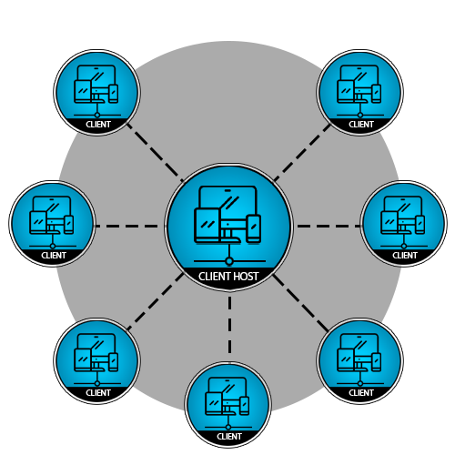
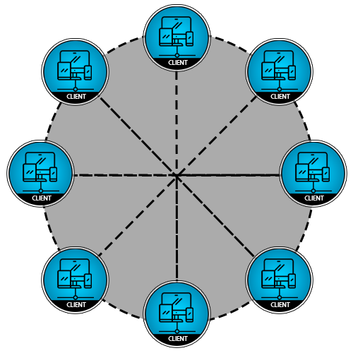

# Network topologies

Network topology defines how a network is arranged. In the context of multiplayer games, this primarily relates to how clients, hosts, and servers are connected and communicate. Different network topologies have different benefits and drawbacks, depending on the type of game you want to make.

The primary network topology that Netcode for GameObjects supports is [client-server](#client-server).

## Client-server

### Dedicated game server

Dedicated servers run the main simulation and manage all aspects of running the networked game. Players connect to the server using separate client programs to see and interact with the game.

Dedicated servers are often the most expensive network topology, but also offer the highest performance and can provide additional functionality such as competitive client prediction, rollback, and a centralized authority to manage any potential client conflicts. However, this comes at the cost of added latencies when communicating state changes from one client to another, as all state changes must be sent from client to server, processed, and then sent back out to other clients.

This network topology is primarily used by performance-sensitive games, such as first-person shooters, or competitive games where having a central server authority is necessary to minimize cheating and the effects of bad actors.

### Client-hosted listen server

Listen servers are similar to dedicated game servers, except that the server runs in the same process as a game client. This makes it a cheaper option, but with the disadvantage that the hosting client has to communicate updates over a residential internet connection. Server performance is also degraded because the machine running the server is also generating an output image for the user playing on that machine.

## Other network topologies

### Local or couch multiplayer

Local multiplayer games use a single client runtime instance that can be played by two or more people on the same screen in the same physical location.

### Offline local area network (LAN)

Local area network games aren't connected to the internet, but use a hosted server onsite to support a local network of clients in the same physical location.

### Peer-to-peer (P2P)

A peer-to-peer network is created when two or more computers are connected and share resources without going through a separate server.

