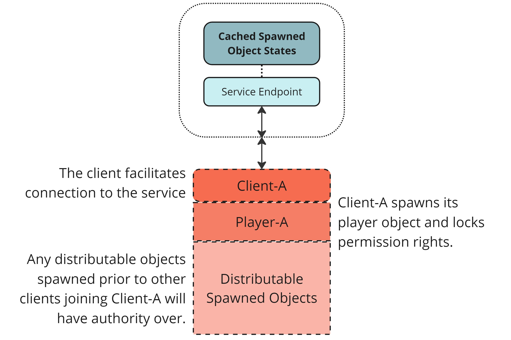
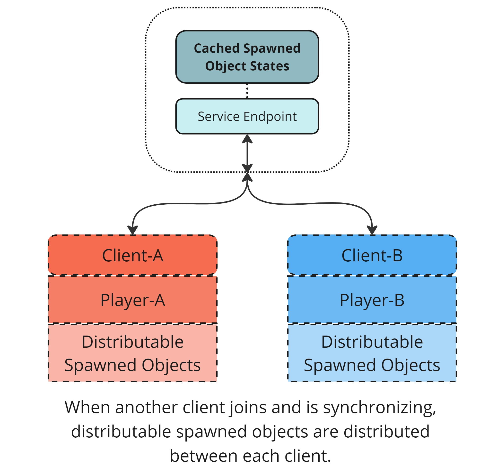

# Ownership

Understand how ownership works in Netcode for GameObjects as a precursor to [authority](./authority.md).

By default, Netcode for GameObjects assumes a [client-server topology](./client-server.md), in which the server owns all NetworkObjects (with [some exceptions](../components/core/networkobject.md#ownership)) and has ultimate authority over [spawning and despawning](../basics/object-spawning.md).

Netcode for GameObjects also supports building games with a [distributed authority topology](./distributed-authority.md), which provides more options for ownership and authority over NetworkObjects.

## Ownership in client-server

In a client-server topology, the server has ultimate authority over all NetworkObjects. Clients can request ownership of [specific objects](../components/core/networkobject.md#ownership), but the server has the final say in whether to grant or deny these requests.

## Ownership in distributed authority

In a distributed authority setting, authority over NetworkObjects isn't bound to a single server, but distributed across clients depending on a NetworkObject's [ownership permission settings](#ownership-permission-settings-distributed-authority-only). NetworkObjects with the distributable permission set are automatically distributed amongst clients as they connect and disconnect.

When a client starts a distributed authority session it spawns its player, locks the local player's permissions so that no other client can take ownership, and then spawns some NetworkObjects. At this point, Client-A has full authority over the distributable spawned objects and its player object.

When another player joins, as in the following diagram, authority over distributable objects is split between both clients. Distributing the NetworkObjects in this way reduces the processing and bandwidth load for both clients. The same distribution happens when a player leaves, either gracefully or unexpectedly. The ownership and last known state of the subset of objects owned by the leaving player is transferred over to the remaining connected clients with no interruption in gameplay.

### Ownership permission settings (distributed authority only)

The following ownership permission settings, defined by [`NetworkObject.OwnershipStatus`](https://docs.unity3d.com/Packages/com.unity.netcode.gameobjects@latest?subfolder=/api/Unity.Netcode.NetworkObject.OwnershipStatus.html), are only relevant when using a distributed authority network topology:

| **Ownership setting** | **Description** |
|-------------------|-------------|
| `None` | Ownership of this NetworkObject can't be redistributed, requested, or transferred (a Player might have this, for example). |
| `Distributable` | Ownership of this NetworkObject is automatically redistributed when a client joins or leaves, as long as ownership is not locked or a request is pending. |
| `Transferable` | Ownership of this NetworkObject can be transferred immediately, as long as ownership isn't locked and there are no pending requests. |
| `RequestRequired` | Ownership of this NetworkObject must be requested before it can be transferred and will always be locked after transfer. |
| `SessionOwner` | This NetworkObject is always owned by the [session owner](distributed-authority.md#session-ownership) and can't be transferred or distributed. If the session owner changes, this NetworkObject is automatically transferred to the new session owner. |

You can also use `NetworkObject.SetOwnershipLock` to lock and unlock the permission settings of a NetworkObject for a period of time, preventing ownership changes on a temporary basis.

> [!NOTE]
> The ownership permissions are only visible when you have the Multiplayer Services SDK package installed and you're inspecting a NetworkObject within the Editor. Ownership permissions have no impact when using a client-server network topology, because the server always has authority.

#### Request ownership

When requesting ownership of a NetworkObject using [`NetworkObject.RequestOwnership`](https://docs.unity3d.com/Packages/com.unity.netcode.gameobjects@latest?subfolder=/api/Unity.Netcode.NetworkObject.RequestOwnership.html), the following outcomes are possible depending on the ownership status of the NetworkObject when the request is received.

| **Ownership status of NetworkObject** | **Response** | **Description** |
|--------------------------|--------------|---------------------|
| `OwnershipStatus.Transferable` | `OwnershipRequestStatus.RequestSent` | Ownership is transferred immediately, as long as a request isn't already in progress and the NetworkObject's ownership isn't locked. Ownership isn't locked after the transfer. |
| `OwnershipStatus.RequestRequired` | `OwnershipRequestStatus.RequestSent` | Request granted, as long as a request isn't already in progress and the NetworkObject's ownership isn't locked. |
| `OwnershipStatus.RequestRequired` but `IsOwner` is `true`for the requesting client | `OwnershipRequestStatus.AlreadyOwner` | No action taken. The current client is already the owner. |
| `OwnershipStatus.RequestRequired` but `IsOwnershipLocked` is `true` | `OwnershipRequestStatus.Locked` | Request denied. The current owner has locked ownership which means requests can't be made at this time. |
| `OwnershipStatus.RequestRequired` but `IsRequestInProgress` is `true` | `OwnershipRequestStatus.RequestInProgress` | Request denied. A known request is already in progress. You can scan for ownership changes and try again after a specific period of time or no longer attempt to request ownership. |
| `OwnershipStatus.SessionOwner` | `OwnershipRequestStatus.SessionOwnerOnly` | Request denied. Only the session owner can have ownership of this NetworkObject. |
| `OwnershipStatus.Distributable` | `OwnershipRequestStatus.RequestRequiredNotSet` | Request denied. Distributable NetworkObjects can only have their ownership changed as part of distribution when clients join or leave a session. |
| `OwnershipStatus.None` | `OwnershipRequestStatus.RequestRequiredNotSet` | Request denied. Ownership of this NetworkObject can't be redistributed, requested, or transferred. |

## Additional resources

* [Authority](authority.md)
* [Client-server](client-server.md)
* [Distributed authority](distributed-authority.md)
