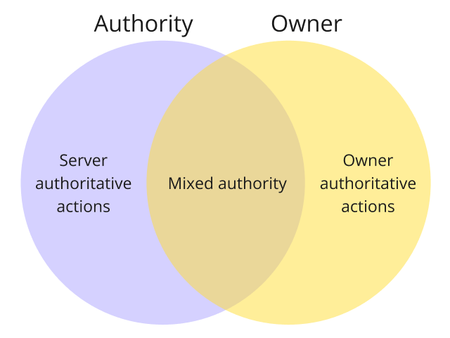
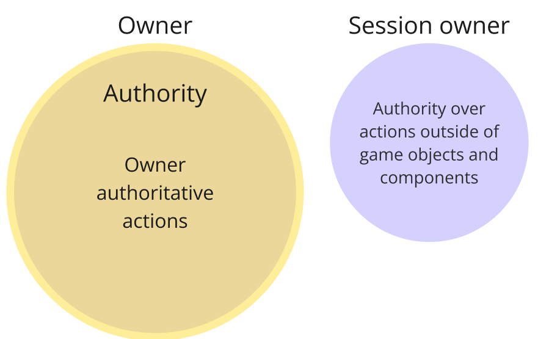

# Ownership

In addition to [authority](./authority.md), ownership is a core concept in Netcode for GameObjects. Ownership behaves slightly differently for each [network topology](network-topologies.md).Ownership is a way to provide client-side reactivity while building a game. This means that the game client who owns a NetworkObject can make changes to that NetworkObject that are networked to all other game clients.

By giving individual clients ownership over NetworkObjects that are important for their gameplay, clients can locally control some parts of their game. For example, this allows clients to avoid lag in their player controller, while leaving the server as the final game authority.

In Netcode for GameObjects, the owner of a NetworkObject receives a subset of authority over that NetworkObject. When a feature is being controlled by the owner, we refer to the feature as being **owner authoritative**.

Ownership behaves slightly differently for each [network topology](network-topologies.md).

## Ownership in client-server

[Client-server](client-server.md) games are referred to as [server authoritative](./authority.md#server-authority). By default, the server always has authority on all aspects of the gameplay and clients must send requests to the server for the server to take actions on behalf of the client. This approach means that the client will always have some lag as they wait for actions to be taken on their behalf.

Ownership allows for clients to take actions on their own, essentially loaning some authority from the server. Giving a client ownership of a NetworkObject will only have effects if that feature is configured to be owner authoritative.

The following table illustrates what actions the authority and the owner can undertake in a client-server game.

|Action|Authority*|Owner|Feature|
|-----|-----|-----|-----|
|Spawn and despawn objects|**Yes**|No||
|Synchronize late joining clients|**Yes**|No||
|Change ownership|**Yes**|No||
|Move transform|By default|Configurable|[Owner authoritative `NetworkTransform`](../components/helper/networktransform.md)|
|Update NetworkObject parenting|By default|Configurable|[`NetworkObject.AllowOwnerToParent`](../advanced-topics/networkobject-parenting.md#who-can-parent-networkobjects)|
|Update NetworkVariables|By default|Configurable|[`NetworkVariableWritePermission.Owner`](../basics/networkvariable.md#write-permissions)|

*The authority when using client-server will always be the server.

## Ownership in distributed authority

In [distributed authority](./distributed-authority.md) the owner of a NetworkObject is always the authority of that NetworkObject. In this way, ownership comes before authority. Authority can be transferred between clients via changing and requesting ownership.

When building your game you can use [ownership permissions](../advanced-topics/networkobject-ownership.md#ownership-permission-settings) to control how and when ownership of NetworkObjects can be transferred between clients.

NetworkObjects with the `OwnershipStatus.Distributable` permission will have their ownership automatically distributed between all connected game clients whenever a new client joins or an existing client leaves. This is the key mechanism in how the game simulation is distributed between clients in a distributed authority session.

## Checking for ownership

The `IsOwner` property, which is available on both NetworkObjects and NetworkBehaviours, is session-mode agnostic and works in both distributed authority and client-server contexts. It's recommended to use `IsOwner` whenever you're synchronizing transform movements, regardless of whether you're using a distributed authority or client-server topology.

## Additional resources

* [Authority](authority.md)
* [Client-server](client-server.md)
* [Distributed authority](distributed-authority.md)
* [NetworkObject ownership](../advanced-topics/networkobject-ownership.md)
